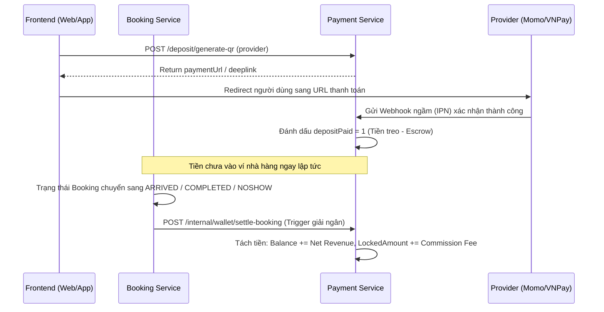
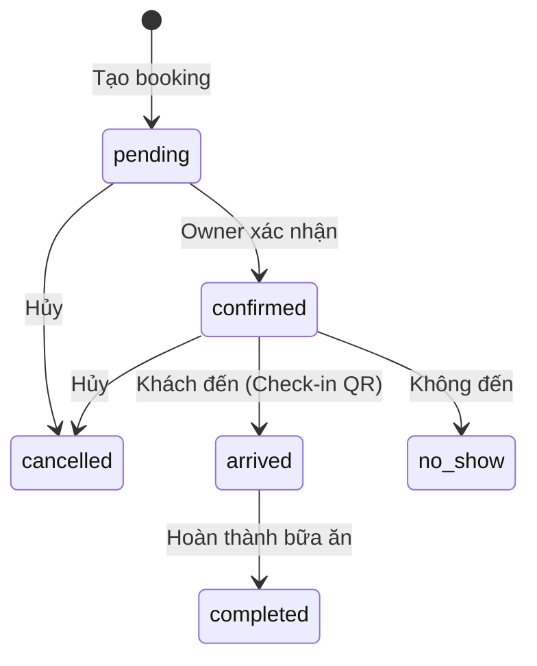

# 📘 SeatNow – Frontend API Reference & Integration Guide

> **Mục đích:** Tài liệu này cung cấp toàn bộ danh sách endpoints, Socket.IO events, và hướng dẫn kết nối frontend cho dự án SeatNow.
> **Cập nhật lần cuối:** 2026-04-18 (v1.3.0)

---

[Lưu ý quan trọng] - Tất cả data BE trả về đều là dạng json

## 🌐 Kiến trúc tổng quan

```
┌──────────────────────────────────────────────────────┐
│               API Gateway (Ocelot .NET)              │
│                 http://localhost:7000                 │
├───────┬───────┬──────┬──────┬──────┬──────┬────┬─────┤
│ Auth  │ User  │ Rest │ Book │ Pay  │Admin │ AI │Noti │
│ :3001 │ :3002 │:3003 │:3004 │:3005 │:3006 │:3007│:3008│
└───────┴───────┴──────┴──────┴──────┴──────┴────┴─────┘
```

| Service                  | Port   | Công nghệ                          | Database                                                  |
| ------------------------ | ------ | ---------------------------------- | --------------------------------------------------------- |
| **API Gateway**          | `7000` | .NET Ocelot                        | –                                                         |
| **Auth Service**         | `3001` | Node.js/Express                    | SQL Server                                                |
| **User Service**         | `3002` | Node.js/Express                    | SQL Server                                                |
| **Restaurant Service**   | `3003` | Node.js/Express                    | SQL Server + MongoDB                                      |
| **Booking Service**      | `3004` | Node.js/Express + Socket.IO        | SQL Server + Redis                                        |
| **Payment Service**      | `3005` | Node.js/Express                    | SQL Server                                                |
| **Admin Service**        | `3006` | Node.js/Express                    | SQL Server (gọi internal API các service khác)            |
| **AI Service**           | `3007` | Python/FastAPI                     | Redis (Chat History + Data Cache) <br> Gemini 1.5/2.0 API |
| **Notification Service** | `3008` | Node.js/Express + Socket.IO + Bull | Redis (Queue)                                             |

---

## 🔑 Xác thực (Authentication)

- **JWT Secret Key:** `vhTony_24_access_secret_key_32ch` (Độ dài 32 ký tự để tương thích .NET 8)
- **Header format:** `Authorization: Bearer <access_token>`
- **Roles:** `CUSTOMER`, `RESTAURANT_OWNER`, `ADMIN`
- Token trả về sau khi login: `{ accessToken: { accessToken, expiresIn }, refreshToken: { refreshToken, expiresIn }, user }`

### 🔒 Cơ chế lưu trữ & Đồng bộ (Hybrid Session Sync)

Hệ thống sử dụng cơ chế **Hybrid Sync** để quản lý phiên làm việc giữa các Tab và tự động Logout:

1.  **Token lưu trong Cookies:** `access_token` và `refresh_token` được lưu dưới dạng **Session Cookie** (không có ngày hết hạn). Trình duyệt sẽ tự động xóa các Cookie này khi người dùng tắt hoàn toàn trình duyệt (Window Close).
2.  **LocalStorage:** Chỉ dùng để lưu thông tin User không nhạy cảm. Thông tin này chỉ hợp lệ khi Cookie chứa Token còn tồn tại.
3.  **Cross-tab Sync (Ping-Pong):** Khi mở Tab mới, Frontend sẽ phát tín hiệu hỏi các Tab khác xem có phiên làm việc nào đang mở không.
    *   Nếu có: Tab mới sẽ chia sẻ Token và tiếp tục giữ đăng nhập.
    *   Nếu không (tất cả tab đã đóng rồi mở lại): Hệ thống tự động xóa sạch các Token rác và yêu cầu đăng nhập lại.

> [!TIP]
> **Hướng dẫn gỡ lỗi:** Nếu bạn thấy lỗi `401 Unauthorized`, hãy kiểm tra mục **Application -> Cookies** trong DevTools để đảm bảo Token còn tồn tại.

## 📡 Gateway Routing Map

Frontend chỉ cần gọi tới `http://localhost:7000` (hoặc domain production). Gateway sẽ chuyển tiếp đúng service.

| Gateway Path (Upstream)          | Service (Downstream)                              | Auth Required  |
| -------------------------------- | ------------------------------------------------- | -------------- |
| `/api/v1/auth/*`                 | Auth Service (:3001)                              | ❌             |
| `/api/v1/users/*`                | User Service (:3002)                              | ✅ JWT         |
| `/api/v1/restaurants/*`          | Restaurant Service (:3003)                        | Tùy endpoint   |
| `/api/v1/portfolio/*`            | Restaurant Service (:3003)                        | ✅ JWT         |
| `/api/v1/bookings/*`             | Booking Service (:3004)                           | Tùy endpoint   |
| `/api/v1/booking-restaurants/*`  | Booking Service (:3004) `→ /api/v1/restaurants/*` | Tùy endpoint   |
| `/api/v1/owner/*`                | Booking Service (:3004)                           | ✅ JWT         |
| `/api/v1/payment/*`              | Payment Service (:3005)                           | Tùy endpoint   |
| `/api/v1/admin/*`                | Admin Service (:3006)                             | ✅ JWT + ADMIN |
| `/api/v1/ai/*`                   | AI Service (:3007) `→ /api/ai/*`                  | ✅ JWT         |
| `/api/v1/notifications/*`        | Notification Service (:3008)                      | ❌             |
| `/socket.io/*` (WebSocket)       | Booking Service (:3004)                           | Tùy event      |
| `/notification.io/*` (WebSocket) | Notification Service (:3008)                      | Tùy event      |

> ⚠️ **Lưu ý:** Route `/api/v1/booking-restaurants/{everything}` trên Gateway sẽ được map xuống `/api/v1/restaurants/{everything}` trên Booking Service. Làm vậy để tránh conflict với Restaurant Service cùng path.

---

## ⚖️ Phân quyền & Luồng nghiệp vụ theo Role (Role-based Permissions & Workflows)

Dưới đây là chi tiết những hành động mà mỗi vai trò (Role) **có thể** và **không thể** thực hiện trong hệ thống.

### 🛡️ 1. ADMIN (Quản trị hệ thống)

- **Có thể làm gì?**
  - **Quản lý toàn bộ dữ liệu:** Xem toàn bộ danh sách người dùng, giao dịch, và booking trên cả hệ thống.
  - **Duyệt/Khoá nhà hàng:** (Quan trọng) Mọi nhà hàng mới do Owner tạo ra ban đầu đều ở trạng thái `pending`. Chỉ Admin mới có quyền gọi API `/restaurants/:id/approve` để kích hoạt (`active`) và tự động cấp Ví (Wallet) cho nhà hàng đó. Sau khi được duyệt, chủ nhà hàng sẽ nhận được một Email thông báo kích hoạt thành công.
  - **Tài chính & Hoa hồng:** Thu phí dịch vụ/hoa hồng từ ví nhà hàng chuyển sang ví tổng của Admin (`settle-quarter`).
  - **Rút tiền:** Phê duyệt hoặc từ chối yêu cầu rút tiền của Owner.
  - **Tạo Owner:** Có thể tạo tài khoản Owner và reset mật khẩu cho Owner nếu họ mất quyền truy cập.
  - **Quản lý thay Owner:** Admin có toàn quyền sửa quán ăn, tạo menu, thiết lập lịch đặt bàn, hay duyệt/hủy booking thay cho Owner (đáp ứng trường hợp hỗ trợ đối tác hoặc quán không rành công nghệ, cấu hình ban đầu).
  - **AI Assistant:** Admin có thể sử dụng AI Assistant đẻ thống kê doanh thu, phân tích hiệu quả kinh doanh, và đưa ra các gợi ý cải thiện.
- **Không thể làm gì?**
  - Không trực tiếp đặt mua dưới danh nghĩa Customer để lấy các quyền lợi khuyến mại khách. Mọi hoạt động của Admin mang tính vận hành giám sát.

### 🏪 2. RESTAURANT OWNER (Chủ nhà hàng)

- **Có thể làm gì?**
  - **Tạo tài khoản:** Owner KHÔNG THỂ tự đăng ký trực tiếp. Phải gửi form "Be my member" qua API Partner Request. Admin sẽ kiểm duyệt và tạo tài khoản thay, sau đó mật khẩu sẽ được gửi tự động về email đăng ký.
  - **Đăng ký nhà hàng mới:** Có thể tự điền đơn tạo nhà hàng bằng API `/restaurants` (tuy nhiên trạng thái hệ thống sẽ đánh là `pending`). Chờ Admin duyệt xong mới bắt đầu nhận được lịch đặt và được cộng tiền cọc vào ví.
  - **Quản lý vận hành thao tác (tại nhà hàng của mình):** Tạo/chỉnh sửa menu món ăn, thêm/xóa/sửa trạng thái sơ đồ bàn, chỉnh sủa các thông tin cơ bản của nhà hàng, cấu hình các phòng/tầng, thay đổi chính sách thu tiền cọc (bật/tắt cọc).
  - **Quản lý booking:** Nhận thông báo đặt bàn Realtime, thao tác chu kỳ đặt bàn bao gồm: Xác nhận (Confirm), Quét QR Check-in (Arrived), báo vắng mặt (No-show), hoặc từ chối/hủy booking. (Lưu ý: Nếu Owner hủy đơn, hệ thống luôn quy ước là khách được hoàn cọc).
  - **Xem thống kê & AI:** Xem biểu đồ lịch sử doanh thu, báo cáo lưu lượng khách, thống kê bàn chật chỗ ở tầng nào, và cả báo cáo chuỗi Portfolio (nếu sở hữu đa chi nhánh). Tích hợp Chat cùng AI để nhận gợi ý kinh doanh.
  - **Tài chính:** Gửi yêu cầu Rút tiền từ Ví (Wallet) của quán về tài khoản ngân hàng (Yêu cầu này sẽ gửi cho Admin duyệt). 
    - _Lưu ý về số dư:_ Số dư khả dụng (`balance`) là số tiền thực nhận (Net Revenue) sau khi đã "tạm ứng" phí hoa hồng vào `lockedAmount`. Nhà hàng chỉ có thể rút tiền từ `balance`.
- **Không thể làm gì?**
  - **KHÔNG THỂ tự kích hoạt nhà hàng (Activate) từ trạng thái Pending:** Khi nhà hàng mới tạo hoặc bị Admin khóa định danh, Owner không thể tự kích hoạt. Tuy nhiên, nếu nhà hàng đã ở trạng thái `active`, Owner có quyền tự chuyển sang `suspended` (để tạm đóng cửa kinh doanh) và tự `active` lại sau đó bằng API `PUT /restaurants/:id`.
  - **KHÔNG THỂ thay đổi phần trăm hoa hồng (Commission Rate) hoặc gói Premium:** Các chỉ số tài chính tính phí định kỳ là dữ liệu nhạy cảm do Admin quyết định và thu tiền.
  - **KHÔNG THỂ tự động duyệt rút tiền:** Lệnh sẽ nằm ở trạng thái "Chờ xử lý" (Pending) cho tới khi nhận dòng tiền thực tế, lúc đó Admin mới chuyển trạng thái Approve.
  - **KHÔNG THỂ nhìn dữ liệu chéo của hệ thống:** Chỉ xem báo cáo và kiểm tra dữ liệu ứng với nhà hàng dưới danh nghĩa chủ sở hữu.

### 👤 3. CUSTOMER (Khách hàng)

- **Có thể làm gì?**
  - **Khám phá mở:** Trải nghiệm danh sách nhà hàng, menu, đánh giá không cần tạo tài khoản.
  - **Đặt bàn (Booking):** Tham gia đặt bàn kèm theo hệ thống "Giữ slot tự động - Lock 2 phút bằng Redis" khi điền thanh toán.
    - _Khách Guest (Vãng lai):_ Cho phép đặt nhưng cần tên,số điện thoại và email.
    - _Customer (Đăng nhập):_ Liên kết lịch sử ăn uống.
  - **Thanh toán Online:** Bấm đặt cọc tại chỗ qua cổng thanh toán Momo / VNPay được hệ thống kết nối.
  - **Hủy đặt bàn & Luật 3 Giờ:** Khách tự thao tác hủy bỏ bàn. _Lưu ý (Quy tắc 3h): Hủy lịch sự trước 3 tiếng thì đánh dấu hợp lệ được Owner hoàn cọc ngoài. Hủy sát giờ hoặc bỏ ngang (No-show) sẽ mất số tiền cọc cho nhà hàng và ứng dụng._
  - **Gửi Review:** Cho phép đánh giá và chụp ảnh lại sau khi trạng thái ăn là `completed`.
  - **Quyền lợi:** Nhận Loyalty Points sau mỗi bữa ăn.
  - **Chat AI Tư Vấn:** Nếu đăng nhập sẽ được quyền liên hệ với AI tư vấn các món ăn và quán theo lịch sử ăn đã lưu trữ.
- **Không thể làm gì?**
  - **KHÔNG THỂ sửa đổi hệ thống:** Không cấp quyền trong menu hay sơ đồ bàn.
  - **KHÔNG THỂ tự báo Ckeck-in thành công:** Việc ấn Check-in (đổi trạng thái) chỉ được định quyền cho account của nhà hàng - Khách đi ăn chỉ xuất trình mã QR Code chứa định danh tại quầy lễ tân để được quét.

---

## 1️⃣ Auth Service (Port 3001)

**Base path:** `/api/v1/auth`

| Method | Endpoint                            | Mô tả                                        | Auth | Request Body                                       |
| ------ | ----------------------------------- | -------------------------------------------- | ---- | -------------------------------------------------- |
| `POST` | `/register`                         | Đăng ký tài khoản                            | ❌   | `{ email, password, phone, fullName, otp, role? }` |
| `POST` | `/login`                            | Đăng nhập                                    | ❌   | `{ email, password }`                              |
| `POST` | `/logout`                           | Đăng xuất                                    | ❌   | `{ refreshToken }`                                 |
| `POST` | `/refresh-token`                    | Làm mới access token                         | ❌   | `{ refreshToken }`                                 |
| `POST` | `/send-otp`                         | Gửi mã OTP qua Email                         | ❌   | `{ email }`                                        |
| `POST` | `/verify-otp`                       | Xác thực OTP (Email)                         | ❌   | `{ email, otp }`                                   |
| `POST` | `/forgot-password/request`          | Yêu cầu reset password (Gửi OTP qua Email)   | ❌   | `{ phone, email? }`                                |
| `POST` | `/forgot-password/verify-and-reset` | Xác thực OTP (Phone) + tự tạo mật khẩu mới   | ❌   | `{ phone, otp }`                                   |
| `POST` | `/google-signin`                    | Đăng nhập bằng Google                        | ❌   | `{ idToken }`                                      |
| `PUT`  | `/change-password`                  | Đổi mật khẩu                                 | ✅   | `{ oldPassword, newPassword, confirmPassword }`    |
| `POST` | `/partner-request`                  | Gửi yêu cầu trở thành đối tác (Be my member) | ❌   | `{ name, phone, email, documentUrl }`              |

### Response mẫu (Login, Register & Refresh Token):

```json
{
  "accessToken": {
    "accessToken": "eyJhbGciOiJ...",
    "expiresIn": "15m"
  },
  "refreshToken": {
    "refreshToken": "eyJhbGciOiJ...",
    "expiresIn": "7d"
  },
  "user": {
    "id": "uuid",
    "email": "user@example.com",
    "fullName": "Nguyen Van A",
    "role": "CUSTOMER"
  }
}
```

> [!NOTE]
> Response của `/refresh-token` sẽ không bao gồm object `user`, chỉ bao gồm `accessToken` và `refreshToken`.

### 1.1 Đổi mật khẩu (Change Password)

Cho phép người dùng đã đăng nhập tự thay đổi mật khẩu của mình.

- **URL:** `PUT /api/v1/auth/change-password`
- **Authentication:** Yes (Bearer Token)
- **Body:**
  ```json
  {
    "oldPassword": "CurrentPassword123!",
    "newPassword": "NewStrongPassword456!",
    "confirmPassword": "NewStrongPassword456!"
  }
  ```
- **Response:**
  - `200 OK`: `{ "success": true, "message": "PASSWORD_CHANGED_SUCCESSFULLY" }`
  - `401 Unauthorized`: Nếu `oldPassword` sai.
  - `400 Bad Request`: Nếu `newPassword` và `confirmPassword` không khớp.

---

### 1.2 Quên mật khẩu (Forgot Password)

Chỉ dành cho tài khoản có Role là **`CUSTOMER`**. Các tài khoản **`RESTAURANT_OWNER`** và **`ADMIN`** không thể tự khôi phục mật khẩu qua API công khai này vì lý do bảo mật.

- **Bước 1: Yêu cầu OTP (Gửi về Email)**
  - **URL:** `POST /api/v1/auth/forgot-password/request`
  - **Body:** `{ "phone": "0912345678" }` (Hệ thống tự tìm Email và gửi mã)
- **Bước 2: Xác thực & Reset**
  - **URL:** `POST /api/v1/auth/forgot-password/verify-and-reset`
  - **Body:** `{ "phone": "0912345678", "otp": "123456" }`
  - **Kết quả:** Xác thực OTP thành công, hệ thống tự sinh mật khẩu mới (8 ký tự) và gửi về Email.

---

## 2️⃣ User Service (Port 3002)

**Base path:** `/api/v1/users`

| Method | Endpoint             | Mô tả                            | Auth | Role     |
| ------ | -------------------- | -------------------------------- | ---- | -------- |
| `GET`  | `/me`                | Xem hồ sơ cá nhân                | ✅   | Any      |
| `PUT`  | `/me`                | Cập nhật hồ sơ                   | ✅   | Any      |
| `GET`  | `/me/wallet`         | Xem thông tin ví                 | ✅   | Any      |
| `GET`  | `/me/bookings`       | Lịch sử đặt bàn của Customer     | ✅   | CUSTOMER |
| `GET`  | `/me/loyalty-points` | Xem điểm thưởng (Loyalty Points) | ✅   | CUSTOMER |

---

## 3️⃣ Restaurant Service (Port 3003)

**Base path:** `/api/v1`

### 3.1 Restaurants (SQL)

| Method | Endpoint                           | Mô tả                      | Auth              | Role |
| ------ | ---------------------------------- | -------------------------- | ----------------- | ---- |
| `GET`  | `/restaurants`                     | Tìm kiếm nhà hàng (bộ lọc) | ❌ (optional JWT) | –    |
| `GET`  | `/restaurants/:id`                 | Chi tiết nhà hàng          | ❌                | –    |
| `GET`  | `/restaurants/:id/reviews`         | Lấy danh sách đánh giá     | ❌                | –    |
| `GET`  | `/restaurants/:id/reviews/summary` | Lấy tóm tắt đánh giá       | ❌                | –    |

> [!TIP]
> **Lưu ý về `:id`**: Tại tất cả các Endpoint lấy thông tin theo nhà hàng (Detail, Menu, Reviews, Availability), bạn có thể truyền vào **ID (UUID)** hoặc **Slug** (ví dụ: `viet-pho-restaurant`) đều được hệ thống tự động nhận diện.

#### Response mẫu (GET Restaurant Detail):

```json
{
  "id": "uuid",
  "name": "The Jade Palace",
  "slug": "the-jade-palace",
  "address": "99 Imperial Way, Ha Long",
  "phone": "0123456789",
  "email": "jade@example.com",
  "cuisineTypes": ["Fine Dining", "Chinese Cuisine"],
  "priceRange": 4,
  "ratingAvg": 4.8,
  "ratingCount": 120,
  "description": "Trải nghiệm ẩm thực hoàng gia...",
  "images": ["url1", "url2"],
  "openingHours": {
    "monday": "09:00-22:00",
    "tuesday": "09:00-22:00"
  },
  "isPremium": true,
  "status": "active",
  "depositEnabled": true,
  "depositPolicy": {
    "required": true,
    "minGuest": 2,
    "minAmount": 50000,
    "note": "Please complete your deposit within 15 minutes to secure your reservation."
  }
}
```

| `POST` | `/restaurants` | Tạo nhà hàng mới | ✅ | ADMIN, OWNER |
| `PUT` | `/restaurants/:id` | Cập nhật thông tin | ✅ | ADMIN, OWNER |
| `PUT` | `/restaurants/:id/deposit-policy` | Cập nhật chính sách cọc | ✅ | ADMIN, OWNER |
| `DELETE` | `/restaurants/:id` | Xóa nhà hàng | ✅ | ADMIN, OWNER |

> [!TIP]
> **Tính năng Tự Đóng/Mở (Self-locking):**
> Chủ nhà hàng (Owner) có thể gửi trường `status` trong body của `PUT /restaurants/:id` để chủ động quản lý việc kinh doanh:
> - `{"status": "suspended"}`: Tạm đóng cửa (Nhà hàng sẽ biến mất khỏi kết quả tìm kiếm).
> - `{"status": "active"}`: Mở cửa hoạt động trở lại.
> - *Điều kiện:* Chỉ có thể tự `active` lại nếu trạng thái trước đó KHÔNG PHẢI là `pending`.

#### 🥗 Danh sách Cuisine Type chuẩn:

Khi tạo/sửa nhà hàng (`cuisineTypes`) hoặc tìm kiếm (`cuisine`), vui lòng sử dụng các giá trị chuẩn sau:

- `Vietnamese Cuisine`
- `European Cuisine`
- `Japanese Cuisine`
- `Chinese Cuisine`
- `Korean Cuisine`
- `Italian Cuisine`
- `French Cuisine`
- `Spanish Cuisine`
- `Mexican Cuisine`
- `Indian Cuisine`
- `Thai Cuisine`
- `Hotpot`
- `Grill`
- `Seafood`
- `Street Food`
- `Fast Food`
- `Cafe`
- `Bar & Pub`
- `Fine Dining`
- `Buffet`
- `Vegetarian`

#### 🔍 Chi tiết bộ lọc Restaurant (Filters):

Hệ thống hỗ trợ lọc cực kỳ linh hoạt tại endpoint `GET /api/v1/restaurants`:

| Param              | Type    | Mô tả                                                                         |
| ------------------ | ------- | ----------------------------------------------------------------------------- |
| `q`                | string  | Tìm kiếm tương đối (LIKE) theo tên nhà hàng hoặc địa chỉ                      |
| `cuisine`          | string  | Lọc theo loại món ăn (phải khớp 1 giá trị trong danh sách chuẩn)              |
| `priceRange`       | number  | Mức giá từ 1 đến 4 ($ - $$$$)                                                 |
| `lat`              | number  | Vĩ độ hiện tại của người dùng (Bắt buộc nếu muốn tính khoảng cách)            |
| `lng`              | number  | Kinh độ hiện tại của người dùng (Bắt buộc nếu muốn tính khoảng cách)          |
| `radiusKm`         | number  | Bán kính tìm kiếm quanh vị trí `lat/lng` (Mặc định: 5km nếu truyền `lat/lng`) |
| `minLat`, `maxLat` | number  | Tọa độ giới hạn khung bản đồ (Bounding Box)                                   |
| `minLng`, `maxLng` | number  | Tọa độ giới hạn khung bản đồ (Bounding Box)                                   |
| `sort`             | string  | Tiêu chí: `rating` (mặc định), `newest`, `distance` (Yêu cầu `lat/lng`)       |
| `isPremium`        | boolean | Chỉ lấy các nhà hàng Premium (nếu `true`)                                     |
| `page`             | number  | Số trang (Dành cho Admin APIs)                                                |
| `limit`            | number  | Số lượng kết quả mỗi trang (Mặc định 20)                                      |
| `offset`           | number  | Vị trí bắt đầu lấy dữ liệu (Dành cho Restaurant APIs)                         |

> [!IMPORTANT]
> **Trường `distanceKm`**: Khi bạn truyền `lat` và `lng`, mỗi đối tượng nhà hàng trong mảng `data` sẽ có thêm trường `distanceKm` (kiểu số, đơn vị Kilomet). Nếu không truyền tọa độ, trường này sẽ là `null`.

#### 📏 Logic Phân trang (Pagination) - Cập nhật mới:

Hiện tại, tất cả các API danh sách chính (Nhà hàng, Review, Menu) đều đã được chuẩn hóa cấu trúc trả về để hỗ trợ phân trang chuyên nghiệp:

**Cấu trúc Response chuẩn:**

```json
{
  "data": [ ... ],       // Mảng dữ liệu thực tế
  "total": 123,          // Tổng số bản ghi thực tế trong Database (Dùng để tính tổng số trang)
  "meta": {              // Thông tin bổ sung
    "limit": 20,
    "offset": 0
  }
}
```

**Sự khác biệt giữa các Service:**

- **Restaurant Service (Public API):** Sử dụng `limit` & `offset`. Trả về cấu trúc `{ data, total, meta }`.
- **Admin Service:** Sử dụng `page` & `limit`. Trả về cấu trúc `{ data, total, pagination: { page, limit } }`.

#### 🧭 Phân loại tìm kiếm Geo-Location (Unified):

1.  **Distance-aware Search:** Bất kể bạn sắp xếp theo `rating` hay `newest`, nếu có truyền `lat` và `lng`, hệ thống luôn tính toán và trả về thêm trường `distanceKm` trong mỗi đối tượng nhà hàng.
2.  **Near-me Search:** Khi truyền `lat`, `lng` và `radiusKm`. Hệ thống sẽ giới hạn kết quả chỉ trong bán kính đó. Kết hợp với `sort=distance` để lấy các quán gần nhất lên đầu.
3.  **Bounding Box Search:** Khi truyền bộ 4 tham số `minLat/maxLat/minLng/maxLng`. Thường dùng khi người dùng kéo thả bản đồ để xem các quán trong khu vực hiển thị.

#### Response mẫu (GET Review Summary):

```json
{
  "totalReviews": 15,
  "averageRating": 4.5,
  "ratingBreakdown": {
    "5_star": 10,
    "4_star": 3,
    "3_star": 2,
    "2_star": 0,
    "1_star": 0
  }
}
```

> [!IMPORTANT]
> **Tài chính & Ví nhà hàng:** Mỗi nhà hàng khi được kích hoạt (`active`) sẽ được Admin cấp một **Ví (Wallet)**. Ví này dùng để nhận tiền cọc từ khách và thực hiện đối soát hoa hồng với hệ thống.

---

### 3.2 Menu (MongoDB)

| Method   | Endpoint                        | Mô tả    | Auth | Role         |
| -------- | ------------------------------- | -------- | ---- | ------------ |
| `GET`    | `/restaurants/:id/menu`         | Xem menu | ❌   | –            |
| `POST`   | `/restaurants/:id/menu`         | Thêm món | ✅   | OWNER, ADMIN |
| `PUT`    | `/restaurants/:id/menu/:itemId` | Sửa món  | ✅   | OWNER, ADMIN |
| `DELETE` | `/restaurants/:id/menu/:itemId` | Xóa món  | ✅   | OWNER, ADMIN |

#### 🔍 Query Params cho `GET /restaurants/:id/menu`:

| Param      | Type   | Mô tả                                                                                               |
| ---------- | ------ | --------------------------------------------------------------------------------------------------- |
| `search`   | string | Tìm kiếm theo tên hoặc mô tả món ăn (không phân biệt hoa thường).                                   |
| `category` | string | Lọc theo danh mục (ví dụ: `Appetizers`, `Drinks`). Sử dụng `all` hoặc để trống để lấy tất cả.       |
| `status`   | string | Lọc theo trạng thái kinh doanh: `true` (Đang bán), `false` (Ngừng bán).                             |
| `sortBy`   | string | Tiêu chí sắp xếp: `newest` (mặc định), `price_asc`, `price_desc`, `name_asc`, `name_desc`, `oldest`. |
| `limit`    | number | Số lượng kết quả mỗi trang (Mặc định: 100).                                                         |
| `offset`   | number | Vị trí bắt đầu lấy dữ liệu (Mặc định: 0).                                                           |

#### Body mẫu (Create Menu Item - POST):

> [!IMPORTANT]
> - **Bắt buộc:** `name`, `price`.
> - **Tùy chọn:** Các trường còn lại.

```json
{
  "name": "Phở Bò Đặc Biệt",
  "description": "Phở bò đặc biệt với đầy đủ topping gầu nạm gân.",
  "price": 75000,
  "discountPrice": 65000,
  "category": "Món Chính",
  "preparationTime": 15,
  "isAvailable": true,
  "images": ["https://..."],
  "tags": ["Signature", "Beef"],
  "allergens": ["Beef"]
}
```

#### Body mẫu (Update Menu Item - PUT):

> [!TIP]
> **Hỗ trợ cập nhật một phần (Partial Update):** Bạn không cần gửi toàn bộ các trường. Chỉ cần gửi những trường nào bạn muốn thay đổi.

```json
{
  "price": 80000,
  "isAvailable": false
}
```

#### Response mẫu (GET Menu):

```json
{
  "data": [
    {
      "_id": "65f...",
      "name": "Pho Bo",
      "price": 50000,
      "isAvailable": true
    }
  ],
  "total": 45,
  "meta": {
    "limit": 100,
    "offset": 0
  }
}
```

### 3.3 Reviews (MongoDB)

| Method | Endpoint                   | Mô tả        | Auth              | Role        |
| ------ | -------------------------- | ------------ | ----------------- | ----------- |
| `GET`  | `/restaurants/:id/reviews` | Xem đánh giá | ❌                | –           |
| `POST` | `/restaurants/:id/reviews` | Gửi đánh giá | ❌ (Optional JWT) | Any / Guest |

#### Response mẫu (GET Reviews):

> [!TIP]
> **Hybrid Review System:** Hệ thống hỗ trợ cả đánh giá tự do và đánh giá qua Booking. 
> - Trường `isVerified: true` nếu đánh giá có gắn kèm `bookingId` hợp lệ.
> - Trường `customerId` sẽ là `null` và `customerName` là `"Khách vãng lai"` nếu người gửi không đăng nhập.

```json
{
  "data": [
    {
      "_id": "65f...",
      "bookingId": "uuid | null",
      "customerId": "uuid | null",
      "restaurantId": "uuid",
      "rating": 5,
      "comment": "Ngon quá!",
      "customerName": "Nguyen Van A",
      "customerAvatar": "https://...",
      "isVerified": true,
      "createdAt": "2026-03-14T..."
    }
  ],
  "total": 15,
  "meta": {
    "limit": 20,
    "offset": 0
  }
}
```

#### Body mẫu (Create Review):

> [!NOTE]
> - `bookingId`: Tùy chọn. Nếu truyền lên, trạng thái của đơn đặt chỗ **bắt buộc phải là `COMPLETED`**.
> - `rating`: Bắt buộc (1-5).
> - **Spam protection:** Hệ thống cho phép gửi nhiều đánh giá cho cùng một nhà hàng.

```json
{
  "bookingId": "<booking-uuid-optional>",
  "rating": 5,
  "comment": "Do an ngon, phuc vu tot",
  "foodRating": 5,
  "serviceRating": 5,
  "atmosphereRating": 4,
  "images": []
}
```

### 3.4 Tables (SQL) – Quản lý bàn & Sơ đồ tầng

| Method   | Endpoint                           | Mô tả                         | Auth              | Role         |
| -------- | ---------------------------------- | ----------------------------- | ----------------- | ------------ |
| `GET`    | `/restaurants/:id/tables`          | Danh sách bàn (hỗ trợ filter) | ❌ (optional JWT) | –            |
| `GET`    | `/restaurants/:id/tables/stats`    | Thống kê sức chứa theo tầng   | ✅                | OWNER, ADMIN |
| `POST`   | `/restaurants/:id/tables`          | Tạo bàn mới                   | ✅                | OWNER, ADMIN |
| `PUT`    | `/restaurants/:id/tables/:tableId` | Sửa bàn                       | ✅                | OWNER, ADMIN |
| `DELETE` | `/restaurants/:id/tables/:tableId` | Xóa bàn                       | ✅                | OWNER, ADMIN |

> [!TIP]
> **Lưu ý về `:id`**: Tại tất cả các Endpoint của Table (List, Stats, Create, Update, Delete), bạn có thể truyền vào **ID (UUID)** hoặc **Slug** nhà hàng đều được hỗ trợ tự động.

#### Query params cho `GET /restaurants/:id/tables`:

| Param      | Type   | Mô tả                                                                         |
| ---------- | ------ | ----------------------------------------------------------------------------- |
| `location` | string | Lọc theo tầng (VD: `1st Floor`, `2nd Floor`, `Rooftop`, `Terrace`, `Outdoor`) |

#### Body mẫu (Create Table - POST):

```json
{
  "tableNumber": "T01",
  "capacity": 4,
  "type": "standard",
  "location": "1st Floor",
  "status": "available"
}
```

#### Body mẫu (Update Table - PUT):

> [!IMPORTANT]
> **Bảo mật**: Hệ thống sẽ tự động kiểm tra `tableId` có thực sự thuộc về `restaurantId` hay không trước khi cho phép cập nhật hoặc xóa.

```json
{
  "status": "unavailable",
  "capacity": 2
}
```

#### Location hợp lệ (CHECK constraint):

`1st Floor`, `2nd Floor`, `3rd Floor`, `4th Floor`, `5th Floor`, `Rooftop`, `Terrace`, `Outdoor`

### 3.5 Availability

| Method | Endpoint                        | Mô tả              | Auth |
| ------ | ------------------------------- | ------------------ | ---- |
| `GET`  | `/restaurants/:id/availability` | Kiểm tra bàn trống | ❌   |

#### Query params:

| Param    | Type   | Mô tả             |
| -------- | ------ | ----------------- |
| `date`   | string | Ngày (YYYY-MM-DD) |
| `time`   | string | Giờ (HH:mm)       |
| `guests` | number | Số khách          |

### 3.6 Statistics (Thống kê)

| Method | Endpoint                         | Mô tả                                           | Auth | Role         |
| ------ | -------------------------------- | ----------------------------------------------- | ---- | ------------ |
| `GET`  | `/restaurants/:id/stats-summary` | KPI Summary cho 1 nhà hàng                      | ✅   | OWNER, ADMIN |
| `GET`  | `/restaurants/:id/revenue-stats` | Biểu đồ doanh thu                               | ✅   | OWNER, ADMIN |
| `GET`  | `/portfolio/summary`             | Tổng hợp Portfolio (toàn bộ nhà hàng của Owner) | ✅   | OWNER, ADMIN |

| `period` | string | `hour`, `day`, `week`, `month`, `quarter`, `year`                                                             |
| `from`   | string | Ngày bắt đầu (YYYY-MM-DD)                                                                                     |
| `to`     | string | Ngày kết thúc (YYYY-MM-DD)                                                                                    |

> [!IMPORTANT]
> **Phân loại Nhóm khách (Guest-Size Groups):**
> Các trường trong `guestSizeCounts` được phân loại như sau:
> - `couple`: 1-2 khách (Cặp đôi/Cá nhân)
> - `smallGroup`: 3-7 khách (Nhóm nhỏ)
> - `party`: 8 khách trở lên (Đoàn đông)
>
> Tỷ lệ phần trăm (`percentCouple`, `percentSmallGroup`, `percentParty`) được hệ thống tính toán tự động dựa trên tổng số booking trong kỳ.

> [!NOTE]
> **Logic mặc định (Auto-fill):** Nếu bạn truyền `period` nhưng không truyền `from/to`, hệ thống sẽ tự động tính toán khoảng ngày mặc định:
> - `period=week`: Mặc định lấy từ đầu tháng đến cuối tháng hiện tại.
> - `period=month`: Mặc định lấy từ đầu năm đến cuối năm hiện tại.

---

## 4️⃣ Booking Service (Port 3004)

**Base path:** `/api/v1`

### 4.1 Booking CRUD

| Method | Endpoint                       | Mô tả                            | Auth              | Role           |
| ------ | ------------------------------ | -------------------------------- | ----------------- | -------------- |
| `POST` | `/bookings`                    | Tạo booking                      | ❌ (optional JWT) | Guest/Customer |
| `GET`  | `/bookings/guest/lookup`       | Tra cứu booking (khách vãng lai) | ❌                | –              |
| `GET`  | `/bookings/my-bookings`        | Danh sách booking của tôi        | ✅                | CUSTOMER       |
| `GET`  | `/bookings/:id`                | Chi tiết booking                 | ✅                | Any            |
| `GET`  | `/bookings/:id/qr`             | Lấy mã QR check-in               | ✅                | OWNER, ADMIN   |
| `GET`  | `/bookings/:id/payment-status` | Kiểm tra trạng thái cọc          | ✅                | OWNER, ADMIN   |

> **QR Code (`GET /bookings/:id/qr`):** Trả về tệp tin hình ảnh trực tiếp (Content-Type: `image/png`). Frontend sử dụng thẻ `` để hiển thị.

> [!IMPORTANT]
> **Check-in Authorization:** API Check-in (`PUT /arrived`) yêu cầu Token của **Chủ nhà hàng (Owner)** hoặc **Admin**. Trạng thái booking hiện tại phải là `CONFIRMED`. Nếu Token hết hạn hoặc không có quyền, hệ thống sẽ trả về lỗi `401` hoặc `403` kèm thông báo chi tiết.

#### Response mẫu (Payment Status - 200 OK):

```json
{
  "bookingId": "uuid",
  "bookingCode": "BK...",
  "depositRequired": true,
  "depositAmount": 200000.0,
  "depositPaid": 1,
  "depositPaidAt": "2026-04-06T...",
  "depositRefunded": 0
}
```

#### Body mẫu (Create Booking – Guest):

```json
{
  "restaurantId": "<uuid>",
  "tableId": "<uuid>",
  "bookingDate": "2026-12-25",
  "bookingTime": "19:00",
  "numGuests": 4,
  "guestName": "Nguyen Van A",
  "guestPhone": "+84901234567",
  "guestEmail": "guest@example.com"
}
```

#### Body mẫu (Create Booking – Customer đã đăng nhập):

```json
{
  "restaurantId": "<uuid>",
  "tableId": "<uuid>",
  "bookingDate": "2026-12-25",
  "bookingTime": "20:00",
  "numGuests": 2
}
```

#### Response mẫu (Tạo mới thành công - 201 Created):

```json
{
  "booking": {
    "id": "7f0a1b2c-...",
    "bookingCode": "BK20261225ABCD",
    "customerId": "uuid | null",
    "guestName": "Nguyen Van A",
    "guestPhone": "+84901234567",
    "restaurantId": "uuid",
    "tableId": "uuid",
    "bookingDate": "2026-12-25",
    "bookingTime": "19:00",
    "numGuests": 4,
    "status": "PENDING",
    "customerName": "Nguyen Van A",
    "customerAvatar": "http://...",
    "tableNumber": "T-05",
    "tableLocation": "Tầng 1",
    "depositRequired": true,
    "depositAmount": 200000.0,
    "depositPaid": 0,
    "checkinUrl": "http://.../checkin?bookingId=...",
    "createdAt": "2026-04-06T...",
    "updatedAt": "2026-04-06T..."
  },
  "depositRequired": true,
  "depositAmount": 200000.0
}
```

#### Query params cho Guest Lookup:

| Param         | Type   | Mô tả               |
| ------------- | ------ | ------------------- |
| `bookingCode` | string | Mã booking          |
| `guestPhone`  | string | Số điện thoại khách |

#### Response mẫu (Chi tiết Booking - 200 OK):

```json
{
  "id": "uuid",
  "bookingCode": "BK...",
  "status": "CONFIRMED",
  "customerName": "Sarah Miller",
  "customerEmail": "sarah.m@example.com",
  "customerPhone": "+84901234567",
  "customerAvatar": "http://...",
  "bookingDate": "2026-12-25",
  "bookingTime": "19:00",
  "numGuests": 4,
  "depositPaid": 1,
  "depositPaidAt": "2026-04-06T...",
  "restaurantId": "uuid",
  "createdAt": "...",
  "updatedAt": "..."
}
```

#### Response mẫu (Danh sách My Bookings - 200 OK):

```json
[
  { "id": "uuid1", "bookingCode": "BK1", "status": "COMPLETED", "...": "..." },
  { "id": "uuid2", "bookingCode": "BK2", "status": "PENDING", "...": "..." }
]
```

### 4.2 Quy tắc tính tiền cọc (Deposit Amount)

Khi người dùng chọn số lượng khách (`numGuests`), Frontend cần tính toán số tiền cọc hiển thị dựa trên `depositPolicy` lấy từ dữ liệu Nhà hàng:

- **Nếu `depositEnabled` = `false`**: Không yêu cầu đặt cọc.
- **Nếu `numGuests` < `depositPolicy.minGuest`**: Không yêu cầu đặt cọc cho đơn này.
- **Lưu ý về `note`**: Chính sách có kèm theo trường `note` (tiếng Anh trang trọng) để hiển thị cho khách hàng về thời hạn thanh toán.
- **Cách tính `depositAmount`**:
  - `depositAmount = minAmount` (Khoản phí cố định cho cả đơn đặt chỗ).

> [!TIP]
> **Lưu ý:** Khi gửi request `POST /bookings`, bạn không cần gửi kèm `depositAmount`. Server sẽ tự tính toán lại dựa trên Policy hiện tại để đảm bảo tính chính xác và an toàn.

### 4.3 Booking Status Updates

| Method | Endpoint                     | Mô tả                              | Auth              | Role                   |
| ------ | ---------------------------- | ---------------------------------- | ----------------- | ---------------------- |
| `PUT`  | `/bookings/:id/confirm`      | Xác nhận booking                   | ✅                | OWNER, ADMIN           |
| `PUT`  | `/bookings/:id/arrived`      | Check-in (khách đến). **Lưu ý:** Chỉ chấp nhận đơn `CONFIRMED`. | ✅                | OWNER, ADMIN           |
| `PUT`  | `/bookings/:id/complete`     | Hoàn thành                         | ✅                | OWNER, ADMIN           |
| `PUT`  | `/bookings/:id/no-show`      | Không đến                          | ✅                | OWNER, ADMIN           |
| `PUT`  | `/bookings/:id/cancel`       | Hủy booking (Customer/Owner/Admin) | ✅                | CUSTOMER, OWNER, ADMIN |
| `PUT`  | `/bookings/:id/cancel/guest` | Hủy booking (Khách vãng lai)       | ❌ (optional JWT) | –                      |
| `PUT`  | `/bookings/:id/modify`       | Chỉnh sửa / Đổi lịch đặt bàn       | ❌ (optional JWT) | Any                    |

> [!IMPORTANT]
> **Chính sách No-show tự động:** Hệ thống có Job quét tự động mỗi phút. Nếu khách không đến sau **15 phút** (Grace Period) kể từ giờ đặt bàn của đơn `CONFIRMED`, trạng thái sẽ tự động chuyển thành `NO_SHOW`.

#### Body mẫu (Modify - Chỉnh sửa lịch):

```json
{
  "bookingDate": "2026-12-26",
  "bookingTime": "20:00",
  "numGuests": 3,
  "guestPhone": "+84901234567"
}
```

_(Lưu ý: `guestPhone` là bắt buộc đối với khách vãng lai để xác minh quyền sở hữu đơn)._

#### Body mẫu (Cancel - Dành cho Customer / Owner / Admin):

```json
{
  "cancellationReason": "Ly do huy don"
}
```

#### Body mẫu (Cancel - Dành riêng cho Khách vãng lai / Guest):

```json
{
  "guestPhone": "+84901234567",
  "cancellationReason": "Ly do huy don"
}
```

> Đối với phương thức Hủy qua API `/bookings/:id/cancel/guest`, trường `guestPhone` là **RẤT QUAN TRỌNG VÀ BẮT BUỘC** nhằm xác minh quyền sở hữu booking dựa vào phiên đặt gốc. Nếu không truyền lên hoặc số điện thoại bị sai lệch, Server sẽ từ chối và trả về HTTP Status `403 Forbidden`.

#### Response mẫu (Sau khi Hủy/Cập nhật trạng thái - 200 OK):

```json
{
  "id": "uuid",
  "bookingCode": "BK...",
  "status": "CANCELLED",
  "cancellationReason": "Ly do huy don",
  "cancelledBy": "GUEST",
  "depositRefunded": 1,
  "updatedAt": "2026-04-06T..."
}
```

### 4.3 Availability (qua Booking Service)

| Method | Endpoint                        | Mô tả                        | Auth |
| ------ | ------------------------------- | ---------------------------- | ---- |
| `GET`  | `/restaurants/:id/availability` | Kiểm tra bàn trống (slot 2h) | ❌   |

#### Query params cho Availability:

| Param     | Type    | Mô tả                                                                                                 |
| --------- | ------- | ----------------------------------------------------------------------------------------------------- |
| `date`    | string  | Ngày đặt (YYYY-MM-DD)                                                                                 |
| `time`    | string  | Giờ đặt (HH:mm)                                                                                       |
| `guests`  | number  | Số lượng khách                                                                                        |
| `refresh` | boolean | `true` để ép buộc xóa cache Redis và truy vấn SQL mới nhất (Dùng cho đồng bộ dữ liệu nếu có sai lệch) |

> ⚠️ **Quan trọng:** Endpoint này trên Booking Service sử dụng Redis Lock để loại trừ bàn đang bị "hold". Khi gọi qua Gateway, dùng: `/api/v1/booking-restaurants/:id/availability`

### 4.4 Owner/Admin Statistics

| Method | Endpoint                               | Mô tả                                                                 | Auth | Role         |
| ------ | -------------------------------------- | --------------------------------------------------------------------- | ---- | ------------ |
| `GET`  | `/restaurants/:id/bookings`            | DS booking của nhà hàng                                               | ✅   | OWNER, ADMIN |
| `GET`  | `/restaurants/:id/revenue-stats`       | Biển đồ doanh thu (Hỗ trợ lấp đầy 0 - Gap filling)                    | ✅   | OWNER, ADMIN |
| `GET`  | `/restaurants/:id/stats-summary`       | Summary KPI (Bao gồm cả trạng thái `NO_SHOW`)                         | ✅   | OWNER, ADMIN |
| `GET`  | `/restaurants/:id/stats/hourly`        | Phân bổ giờ đặt bàn                                                   | ✅   | OWNER, ADMIN |
| `GET`  | `/restaurants/:id/commissions/summary` | Tóm tắt hoa hồng                                                      | ✅   | OWNER, ADMIN |
| `POST` | `/restaurants/:id/commissions/settle`  | Chốt hoa hồng                                                         | ✅   | OWNER, ADMIN |
| `GET`  | `/portfolio/restaurants`               | DS nhà hàng Portfolio                                                 | ✅   | OWNER, ADMIN |
| `GET`  | `/portfolio/summary`                   | Tổng hợp Portfolio                                                    | ✅   | OWNER, ADMIN |
| `GET`  | `/owner/revenue-stats`                 | Doanh thu Portfolio (Hỗ trợ lấp đầy 0 - Gap filling)                  | ✅   | OWNER, ADMIN |
| `GET`  | `/owner/stats/hourly`                  | Phân bổ giờ Portfolio                                                 | ✅   | OWNER, ADMIN |

#### Query params hỗ trợ cho `GET /restaurants/:id/bookings`:

| Param    | Type   | Mô tả                                                                                                        |
| -------- | ------ | ------------------------------------------------------------------------------------------------------------- |
| `limit`  | number | Số lượng kết quả (Mặc định: 50)                                                                                |
| `offset` | number | Phân trang (vị trí bắt đầu)                                                                                                    |
| `from`   | string | Lọc ngày bắt đầu (YYYY-MM-DD). Cần truyền vào tham số này nếu muốn lấy lịch đặt tương lai.                    |
| `to`     | string | Lọc ngày kết thúc (YYYY-MM-DD)                                                                                |
| `status` | string | Trạng thái (VD: `CONFIRMED`, `PENDING`)                                                                    |
| `sort`   | string | Sắp xếp mốc thời gian booking. Mặc định là `DESC` (giảm dần/mới nhất). Chuyển thành `ASC` nếu lấy "Sắp tới" (Upcoming) |

> 🧩 **Cấu trúc Dữ liệu mới (Cập nhật 2026-04-12):** 
> Endpoint `GET /restaurants/:id/bookings` hiện trả về một Object chứa danh sách và thông tin thống kê tóm tắt, giúp Frontend không cần gọi thêm API phụ.
>
> **Cấu trúc Response:**
> ```json
> {
>   "items": [ 
>     { 
>       "id": "uuid", 
>       "bookingCode": "BK...", 
>       "customerName": "Nguyen Van A", 
>       "customerEmail": "a.nguyen@example.com",
>       "customerPhone": "0987654321",
>       "customerAvatar": "http://...", 
>       "tableNumber": "T-05", 
>       "tableLocation": "Tầng 2",
>       "...": "..." 
>     } 
>   ],
>   "total": 45,          // Tổng số bản ghi thỏa mãn bộ lọc (dùng cho phân trang)
>   "summary": {         // Thống kê nhanh trong khoảng ngày (không bị ảnh hưởng bởi filter status)
>     "total": 45,        // Tổng đơn trong ngày/khoảng ngày
>     "completed": 30,    // Số đơn hoàn thành
>     "cancelled": 5      // Tổng số đơn Hủy + No-show
>   },
>   "limit": 50,
>   "offset": 0
> }
> ```

> [!TIP]
> **Nhãn thời gian tiếng Anh (Labels):** 
> - Đối với `period=week`, nhãn sẽ có dạng shorthand: `Apr W1`, `Apr W2`, `May W1`,...
> - Đối với `period=hour`, nhãn sẽ có dạng: `00:00`, `02:00`,... (bucket 2 giờ).
> - **Lấp đầy dữ liệu (Gap-filling):** Hệ thống luôn trả về đầy đủ các mốc thời gian trong khoảng lọc. Nếu không có dữ liệu, các giá trị sẽ được trả về là `0` thay vì bị bỏ qua.

#### Response mẫu (Stats Summary - 200 OK):

```json
{
  "data": {
    "restaurantId": "uuid",
    "totalBookings": 150,
    "totalRevenue": 45000000,
    "totalGrossRevenue": 50000000,
    "totalCancelled": 12,
    "totalNoShow": 5,
    "cancellationRate": 0.1133,
    "guestSizeCounts": {
      "couple": 80,         // 1-2 khách
      "smallGroup": 50,     // 3-7 khách
      "party": 20,          // 8+ khách
      "percentCouple": 53.33,
      "percentSmallGroup": 33.33,
      "percentParty": 13.34
    },
    "comparisons": {
      "revenueGrowth": 12.5, // % tăng trưởng doanh thu vs kỳ trước
      "bookingsGrowth": 8.4, // % tăng trưởng số đơn vs kỳ trước
      "period": "MoM" // Month-over-Month
    }
  }
}
```

#### Response mẫu (Portfolio Summary - 200 OK):

```json
{
  "data": {
    "summary": {
      "totalBookings": 450,
      "totalRevenue": 135000000,
      "totalGrossRevenue": 150000000,
      "portfolioTotalReviews": 1200,
      "portfolioRatingAvg": 4.85,
      "guestSizeCounts": {
        "couple": 240,
        "percentCouple": 53.33,
        "smallGroup": 150,
        "percentSmallGroup": 33.33,
        "party": 60,
        "percentParty": 13.33
      },
      "comparisons": {
        "revenueGrowth": 15.2,
        "bookingsGrowth": 10.5
      }
    },
    "breakdown": [
      {
        "restaurantId": "uuid-1",
        "name": "Restaurant A",
        "totalBookings": 200,
        "totalRevenue": 60000000,
        "totalGrossRevenue": 65000000,
        "guestSizeCounts": { "couple": 100, "smallGroup": 70, "party": 30 }
      }
    ]
  }
}
```

> Khi gọi qua Gateway, các route `/restaurants/*` dùng prefix: `/api/v1/booking-restaurants/...`
> Các route `/owner/*` dùng prefix: `/api/v1/owner/...`

### 4.5 Socket.IO Events (Real-time)

**Kết nối:** `io("http://localhost:7000", { auth: { token: "<JWT>" } })`

> [!IMPORTANT]
> **Gateway Integration:** Hiện tại Socket.IO đã được cấu hình đi qua Gateway (port 7000). Gateway sẽ tự động proxy các request có path `/socket.io/` xuống Booking Service (port 3004).

#### Client → Server (emit):

| Event                  | Payload                                               | Mô tả                                   |
| ---------------------- | ----------------------------------------------------- | --------------------------------------- |
| `joinRestaurant`       | `restaurantId` (string)                               | Join room để nhận cập nhật availability |
| `joinRestaurantOwners` | `restaurantId` (string)                               | Join room riêng cho Owner/Admin         |
| `leaveRestaurant`      | `restaurantId` (string)                               | Rời room                                |
| `holdTable`            | `{ restaurantId, tableId, bookingDate, bookingTime }` | Giữ bàn tạm (2 phút)                    |
| `releaseHold`          | `{ restaurantId, tableId, bookingDate, bookingTime }` | Thả bàn đã giữ                          |

#### Server → Client (on):

| Event                 | Payload                                                       | Mô tả                                                                |
| --------------------- | ------------------------------------------------------------- | -------------------------------------------------------------------- |
| `availabilityChanged` | `{ restaurantId, bookingDate, bookingTime }`                  | **(Deprecated)** Có thay đổi về bàn (Nên dùng `tableStatusChanged`). |
| `tableStatusChanged`  | `{ restaurantId, tableId, bookingDate, bookingTime, status }` | **(New - Zero Latency)** Thông báo trạng thái chi tiết của một bàn.  |
| `bookingChanged`      | `{ bookingId, status, ... }`                                  | Trạng thái booking thay đổi (Dành cho Owner/User).                   |

#### 📍 Chi tiết sự kiện `tableStatusChanged`:

Sự kiện này được phát ra ngay lập tức khi một bàn cụ thể có sự thay đổi về trạng thái, giúp Frontend cập nhật màu sắc bàn trên sơ đồ mà không cần gọi lại API.

**Các trạng thái (`status`):**

- `available`: Bàn trống hoàn toàn, có thể chọn (Màu xanh). Được kích hoạt khi hết hạn Hold (2p), Hủy đơn, hoặc Booking hoàn thành/No-Show.
- `held`: Bàn đang được người dùng khác nhấn chọn - giữ chỗ tạm 2 phút (Màu cam).
- `occupied`: Bàn đã được đặt thành công - Booking ở trạng thái `PENDING` hoặc `CONFIRMED` (Màu đỏ).

**Dữ liệu mẫu:**

```json
{
  "restaurantId": "BA3FB828-C52C-4FBE-83E7-4F326A9892A2",
  "tableId": "D1E2F3G4...",
  "bookingDate": "2026-04-05",
  "bookingTime": "19:00",
  "status": "held"
}
```

#### Callback Response (holdTable):

```json
// Thành công
{ "success": true, "expiresIn": 120 }

// Thất bại
{ "error": "Table is being selected by another user" }
```

---

## 5️⃣ Payment Service (Port 3005)

Hệ thống thanh toán chịu trách nhiệm xử lý các giao dịch đặt cọc (Deposit) cho Booking và nạp tiền (Top-up) vào ví nhà hàng qua cổng Momo/VNPay.

**Base path:** `/api/v1/payment`
| Method | Endpoint | Mô tả | Auth |
| ------ | ---------------------- | --------------------------- | -------- |
| `POST` | `/deposit/generate-qr`        | Tạo QR thanh toán cọc              | Tùy      |
| `GET`  | `/transaction/:id`            | Xem chi tiết giao dịch             | Tùy      |
| `POST` | `/wallet/topup/create`        | Nạp tiền ví                        | Tùy      |
| `GET`  | `/wallet/balance`             | Xem số dư ví                       | Tùy      |
| `GET`  | `/wallet/transactions`        | Lịch sử giao dịch ví               | Tùy      |
| `POST` | `/internal/wallet/settle-booking` | Giải ngân tiền cọc (Internal)   | Internal |
| `POST` | `/wallet/withdraw`            | Yêu cầu rút tiền                   | ✅       |

### 💵 5.1 QR Code / Redirect Link Generation

Sử dụng Endpoint này để lấy URL thanh toán. Frontend sẽ redirect người dùng sang cổng thanh toán tương ứng.

| Method | Endpoint               | Mô tả                        | Auth          |
| ------ | ---------------------- | ---------------------------- | ------------- |
| `POST` | `/deposit/generate-qr` | Tạo link thanh toán cọc      | ✅ (optional) |
| `POST` | `/wallet/topup/create` | Tạo link nạp tiền vào ví     | ✅            |
| `GET`  | `/transaction/:id`     | Tra cứu trạng thái giao dịch | ✅            |

#### 📥 Request Body (Deposit):

```json
{
  "bookingId": "4A3B2C1D-E5F6-4A7B-8C9D-0E1A2B3D4F5E",
  "provider": "MOMO" // Hoặc "VNPAY"
}
```

#### 📥 Request Body (Wallet Top-up):

```json
{
  "restaurantId": "CBB0BE6F-D2DB-4A17-8951-EB6E53A44EFD",
  "provider": "MOMO", // Hoặc "VNPAY"
  "amount": 500000
}
```

> [!TIP]
> **Tính năng Ghi đè (Supersede):** Nếu Booking đã có một giao dịch đang chờ (`Pending`), hệ thống sẽ **KHÔNG** báo lỗi 409 nữa. Thay vào đó, Backend sẽ tự động hủy giao dịch cũ và tạo link thanh toán mới. Frontend có thể tự tin gọi lại API này khi khách bấm "Đổi phương thức thanh toán".

#### 📤 Response Body mẫu (Momo):

```json
{
  "success": true,
  "data": {
    "transactionId": "TXN_123456",
    "referenceCode": "DEP-240405-ABCD",
    "provider": "MOMO",
    "amount": 500000,
    "currency": "VND",
    "paymentUrl": "https://test-payment.momo.vn/...", // Web redirect
    "deeplink": "momo://app?action=...", // App-to-App
    "qrCodeUrl": "https://static.momo.vn/..." // Static QR Image
  }
}
```

### 🔁 5.2 Quy trình Thanh toán (Lifecycle)

Hệ thống xử lý thanh toán theo mô hình Redirect & Webhook (IPN).



#### 📍 Lưu ý quan trọng cho Frontend:

1.  **Chế độ Giam tiền (Escrow)**: Kể từ phiên bản này, tiền cọc của khách hàng sẽ **không** được cộng ngay vào ví nhà hàng khi thanh toán thành công. Tiền sẽ được hệ thống giữ ở trạng thái "Chờ giải ngân".
2.  **Thời điểm giải ngân**: Tiền chỉ được chuyển vào ví nhà hàng khi đơn hàng đạt trạng thái kết thúc có lợi cho nhà hàng:
    *   Khách đến (`ARRIVED`) hoặc Hoàn thành (`COMPLETED`).
    *   Khách không đến (`NO_SHOW`).
    *   Khách hủy muộn (Late Cancel) mà không được hoàn tiền.
3.  **Phân tách số dư khi giải ngân (Partition)**: Khi giải ngân, tiền cọc (`depositAmount`) được tách thành 2 phần:
    *   `balance += depositAmount - commissionFee` → **Doanh thu thuần** (Nhà hàng có thể rút).
    *   `lockedAmount += commissionFee` → **Phí hoa hồng bị khóa** (Chờ Admin thu).
4.  **Tra cứu (Polling)**: Nếu chưa nhận được tín hiệu từ Socket, FE có thể gọi API `GET /transaction/:id` để kiểm tra trạng thái giao dịch.

### 🌐 5.3 Webhook & Return URLs (Public)

Các URL này do Cổng thanh toán gọi trực tiếp:

| Method | Endpoint         | Mô tả                                  |
| ------ | ---------------- | -------------------------------------- |
| `POST` | `/webhook/momo`  | Momo Notify URL (Xử lý giao dịch ngầm) |
| `POST` | `/webhook/vnpay` | VNPay IPN URL (Xử lý giao dịch ngầm)   |
| `GET`  | `/return/momo`   | Redirect trở lại UI sau khi trả tiền   |
| `GET`  | `/return/vnpay`  | Redirect trở lại UI sau khi trả tiền   |

#### 💳 Wallet & Withdrawals (Chủ nhà hàng / Admin)

| Method | Endpoint               | Mô tả                                              | Auth |
| ------ | ---------------------- | -------------------------------------------------- | ---- |
| `GET`  | `/wallet/balance`             | Kiểm tra số dư ví & Thống kê chi tiết (hỗ trợ `restaurantId` query)                                       | ✅   |
| `GET`  | `/wallet/history`             | Lịch sử giao dịch ví (Toàn bộ hoặc lọc theo `type=WITHDRAWAL`)                                                       | ✅   |
| `GET`  | `/wallet/recent-transactions` | Lấy 5 giao dịch thanh toán tiền cọc mới nhất phục vụ Dashboard (kèm thông tin khách hàng, số bàn, mã đơn)      | ✅   |
| `POST` | `/wallet/withdraw`            | Yêu cầu rút tiền từ ví (chỉ rút từ `balance`)                                                               | ✅   |

> 🧩 **Yêu cầu rút tiền (Withdrawal Request) Payload:**
> ```json
> {
>   "idOrSlug": "celestial-bistro", // UUID hoặc URL Slug của nhà hàng
>   "amount": 1500000,
>   "description": "Rút tiền doanh thu tuần",
>   "withdrawMethod": "CARD", // "CARD" hoặc "QR"
>   "bankInfo": {
>     "bankName": "NCB",
>     "cardNumber": "9704198526191432198",
>     "accountName": "NGUYEN VAN A",
>     "expiryDate": "07/15",
>     "cvv": "123"
>   },
>   "qrCodeUrl": null // Hoặc URL ảnh QR nếu dùng mode QR
> }
> ```

> 🧩 **Cấu trúc Số dư Ví (Wallet Balance):**
> ```json
> {
>   "balance": 8500000,           // Số dư khả dụng (Có thể rút ngay)
>   "lockedAmount": 500000,      // Phí hoa hồng tạm giữ (Nợ SeatNow)
>   "pendingWithdrawal": 1000000, // Tổng tiền đang trong lệnh rút (Chưa được duyệt)
>   "latestPendingWithdrawal": 1000000, // Số tiền của lệnh rút gần nhất đang chờ duyệt
>   "totalWithdrawnSuccess": 5000000, // Tổng số tiền đã rút thành công từ trước tới nay
>   "totalWithdrawalCount": 12,    // Tổng số lệnh rút tiền đã tạo
>   "totalTransactionCount": 45,   // Tổng số giao dịch phát sinh (Nạp, rút, cọc...)
>   "currency": "VND"
> }
> ```
> 
> 🧩 **Lịch sử giao dịch (Wallet History):**
> - **Endpoint:** `/wallet/history`
> - **Query Params:** 
>   - `restaurantId`: (Bắt buộc) UUID hoặc Slug.
>   - `type`: (Tùy chọn) `WITHDRAWAL` để lọc riêng lịch sử rút tiền.
> ```json
> {
>   "success": true,
>   "data": [
>     {
>       "id": "uuid",
>       "bookingId": "uuid",
>       "type": "DEPOSIT_PAYMENT",
>       "amount": 300000.0,
>       "commissionFee": 60000.0,
>       "netAmount": 240000.0,
>       "currency": "VND",
>       "status": "completed",
>       "createdAt": "2026-04-12T07:30:00.000Z",
>       "bookingCode": "BK20260412ABCD",
>       "customerName": "Sarah Miller",
>       "customerAvatar": "http://...",
>       "tableNumber": "T-05",
>       "tableLocation": "Tầng 1"
>     }
>   ]
> }
> ```

### 🛡️ 5.4 Internal Operations (Chỉ dành cho Services)

Các API này yêu cầu Header `x-internal-token` và không được tiếp cận trực tiếp từ Frontend/Public.

| Method | Endpoint | Mô tả |
| :--- | :--- | :--- |
| `POST` | `/internal/wallet/settle-booking` | Giải ngân tiền cọc: `balance += netRevenue`, `lockedAmount += commissionFee`. |

#### Body mẫu (Settle):
```json
{
  "bookingId": "uuid-cua-booking"
}
```

---

## 6️⃣ Admin Service (Port 3006)

**Base path:** `/api/v1/admin`

> ⚠️ Tất cả route đều yêu cầu **JWT + Role ADMIN**

### 6.1 Dashboard

| Method | Endpoint                   | Mô tả                    |
| ------ | -------------------------- | ------------------------ |
| `GET`  | `/dashboard/stats`         | Thống kê tổng quan       |
| `GET`  | `/dashboard/revenue-stats` | Thống kê doanh thu Admin (Hỗ trợ Zero-filling) |

> **Tham số query cho GET /dashboard/stats**:
> - `period`: Lọc nhanh theo kỳ (`today`, `week`, `month`, `quarter`, `year`).
> - `from`, `to`: Lọc chính xác theo dải ngày (ISO Date).

#### 📈 Thống kê doanh thu (`GET /dashboard/revenue-stats`):
Hệ thống sử dụng kỹ thuật **Zero-filling** để đảm bảo biểu đồ luôn đầy đủ các mốc thời gian ngay cả khi không có doanh thu.

**Đặc điểm dữ liệu:**
- **Today**: Trả về đúng 24 điểm dữ liệu (tương ứng 24 giờ trong ngày).
- **Week**: Trả về 7 điểm dữ liệu (tương ứng 7 ngày gần nhất).
- **ISO Format**: `timePeriod` luôn trả về định dạng ISO chuẩn (ví dụ: `2026-04-17T01:00:00Z`).

**Response mẫu:**
```json
[
  { "timePeriod": "2026-04-17T00:00:00Z", "totalAdminCommission": 0, "totalBookings": 0 },
  { "timePeriod": "2026-04-17T01:00:00Z", "totalAdminCommission": 25000, "totalBookings": 1 },
  ...
]
```

### 6.2 Quản lý Nhà hàng

| Method | Endpoint                    | Mô tả                              |
| ------ | --------------------------- | ---------------------------------- |
| `POST` | `/restaurants`              | Tạo nhà hàng (trạng thái `active`) |
| `PUT`  | `/restaurants/:id`          | Cập nhật nhà hàng                  |
| `GET`  | `/restaurants`              | Danh sách tất cả nhà hàng (search) |
| `GET`  | `/restaurants/pending`      | Danh sách nhà hàng chờ duyệt       |
| `PUT`  | `/restaurants/:id/approve`  | Duyệt mới → `active` + tạo Wallet  |

> **Tham số query cho GET /restaurants**:
> - `q`: Tìm kiếm theo tên hoặc địa chỉ nhà hàng.
> - `status`: Lọc theo trạng thái (`active`, `pending`, `suspended`, `all`). Mặc định: `all`.
> - `ownerId`: Lọc nhà hàng của một chủ sở hữu cụ thể (UUID).
> - `page`, `limit`: Phân trang.
| `PUT`  | `/restaurants/:id/activate` | Mở khóa lại nhà hàng (Owner không thể mở nếu Admin đã khóa) |
| `PUT`  | `/restaurants/:id/suspend`  | Tạm ngưng nhà hàng (Xác định ai khóa qua trường `suspendedBy`) |

### 6.3 Quản lý Người dùng & Đối tác

| Method   | Endpoint                          | Mô tả                                                                     |
| -------- | --------------------------------- | ------------------------------------------------------------------------- |
| `POST`   | `/users/restaurant-owner`         | Tạo tài khoản Owner                                                       |
| `POST`   | `/users/owner/:id/reset-password` | Reset mật khẩu Owner                                                      |
| `GET`    | `/users`                          | Danh sách người dùng                                                      |
| `GET`    | `/bookings`                       | Danh sách tất cả booking                                                  |

> **Tham số query cho GET /users**:
> - `keyword`: Tìm kiếm theo tên, email hoặc số điện thoại.
> - `role`: Lọc theo vai trò (`CUSTOMER`, `RESTAURANT_OWNER`, `OWNER`, `ADMIN`).
>
> **Tham số query cho GET /bookings**:
> - `status`: Lọc theo trạng thái booking (`pending`, `confirmed`, `arrived`, `completed`, `cancelled`, `no_show`).
> - `restaurantId`: Xem booking của một nhà hàng cụ thể.
> - `dateFrom`, `dateTo`: Lọc theo khoảng thời gian đặt bàn.

| `GET`    | `/transactions`                   | Danh sách giao dịch                                                       |
| `GET`    | `/partner-requests`               | Lấy danh sách yêu cầu trở thành đối tác                                   |
| `POST`   | `/partner-requests/:id/approve`   | Duyệt đối tác (hệ thống tự tạo tài khoản Owner và gửi mật khẩu qua email) |
| `DELETE` | `/partner-requests/:id/reject`    | Từ chối yêu cầu đối tác                                                   |

### 6.4 Tài chính & Đối soát (Settlement)

| Method | Endpoint                      | Mô tả                      |
| ------ | ----------------------------- | -------------------------- |
| `POST` | `/commissions/collect`       | Thu phí hoa hồng linh hoạt (tùy chọn date range) |
| `POST` | `/commissions/settle-quarter` | Đối soát hoa hồng theo quý                        |
| `POST` | `/withdrawals/:id/approve`    | Duyệt lệnh rút tiền        |
| `POST` | `/withdrawals/:id/reject`     | Từ chối lệnh rút tiền      |

#### 💸 Thu phí hoa hồng linh hoạt (`POST /commissions/collect`):
Cho phép Admin thu phí bất cứ lúc nào cho một khoảng thời gian tự chọn.

**Body mẫu:**
```json
{
  "from": "2026-04-01T00:00:00Z",
  "to": "2026-04-15T23:59:59Z",
  "restaurantIds": ["uuid1", "uuid2"], // Tùy chọn, nếu không gửi sẽ thu toàn bộ quán
  "description": "Thu phí đợt đầu tháng 4",
  "dryRun": false, // Nếu true thì chỉ xem trước kết quả, không trừ tiền
  "minAgeMinutes": 0 // Chỉ thu các đơn đã hoàn thành ít nhất X phút trước
}
```
**Response mẫu:**
```json
{
  "success": true,
  "data": {
    "totalCharged": 1500000.0,
    "totalMarked": 45, // Tổng số đơn đã chốt
    "restaurants": [
       { "restaurantId": "uuid", "amount": 250000, "status": "settled" },
       ...
    ]
  }
}
```

### 6.5 Cấu hình hệ thống (System Config)

**Base path:** `/api/v1/admin/configs`

| Method | Endpoint      | Mô tả                                      | Auth | Request Body                                 |
| ------ | ------------- | ------------------------------------------ | ---- | -------------------------------------------- |
| `GET`  | `/commission` | Lấy cấu hình thu phí hoa hồng tự động      | ✅   | ❌                                           |
| `POST` | `/commission` | Cập nhật cấu hình thu phí hoa hồng tự động  | ✅   | `{ autoEnabled: boolean, interval: string }` |

- **`autoEnabled`**: Bật/Tắt tính năng quét nợ tự động.
- **`interval`**: `DAY` (Hàng ngày), `WEEK` (Thứ 2 hàng tuần), `MONTH` (Mùng 1 hàng tháng), `QUARTER` (Đầu quý), `YEAR` (Đầu năm).

#### Response mẫu (GET /commission):
```json
{
  "success": true,
  "data": {
    "autoEnabled": true,
    "interval": "MONTH",
    "updatedAt": "2026-04-10T14:00:00.000Z"
  }
}
```

#### 💸 Quy trình Đối soát Hoa hồng (Commission Settlement):

Hệ thống sử dụng cơ chế **Cumulative Locked Amount** để bảo vệ dòng tiền hoa hồng cho Admin.

1.  **Tích lũy (Accumulation):** Mỗi khi đơn hàng được giải ngân (`Settle`), phí hoa hồng được tự động trích từ tiền cọc và đưa vào `lockedAmount` của ví nhà hàng. Nhà hàng chỉ nhận được phần Doanh thu thuần (Net Revenue) vào `balance`.
2.  **Thu phí (Collection):** Admin có thể thu phí thủ công hoặc bật tính năng **Tự động thu phí (Auto-Collection)** theo chu kỳ (Ngày/Tuần/Tháng/Quý/Năm).
3.  **Khấu trừ (Charge):** Khi thu phí, tiền được trừ trực tiếp từ `lockedAmount` của nhà hàng sang ví Admin.
4.  **Minh bạch:** Mỗi lần thu phí đều tạo 2 bản ghi giao dịch (Transaction) loại `COMMISSION` cho cả nhà hàng và Admin để đối soát.

---

### 📊 Tính năng Phân tích & Quản trị (Advanced Analytics)

Hệ thống cung cấp bộ công cụ phân tích từ Admin Service và AI Service:

1.  **Thống kê thời gian thực (Dashboard):**
    - Tổng doanh thu (GMV), Tổng phí hoa hồng (Net Revenue).
    - Tỷ lệ hủy bàn (Cancellation Rate).
    - Tỷ lệ lấp đầy bàn theo khung giờ (Hourly Occupancy).
2.  **Phân tích Portfolio (Dành cho Owner nhiều chi nhánh):**
    - So sánh hiệu quả kinh doanh giữa các cơ sở.
    - Nhận diện cơ sở có doanh thu cao nhất/thấp nhất.
3.  **AI Business Analyst (Trợ lý ảo Admin):**
    - **Revenue Summary:** Tóm tắt tình hình tài chính bằng ngôn ngữ tự nhiên.
    - **Trend Prediction:** Dự báo xu hướng đặt bàn trong tương lai dựa trên dữ liệu lịch sử.
    - **Suggestion Engine:** Đưa ra gợi ý cải thiện kinh doanh (VD: "Tăng khuyến mãi vào tối Thứ 2 để lấp đầy 30% bàn trống").

---

## 📧 Hệ thống Thông báo & Email (Notifications)

Dịch vụ thông báo (`notification-service`) quản lý việc gửi tin nhắn Real-time (Socket) và Email chuyên nghiệp.

### 📩 Luồng gửi Email:

Hệ thống sử dụng các HTML Template chuyên nghiệp (Responsive) cho các trường hợp:

1.  **Xác nhận đặt bàn (Booking Confirmation):** Gửi ngay khi Owner nhấn "Confirm". Kèm mã QR và thông tin chi tiết. (Sử dụng mẫu template `getBookingConfirmedTemplate`).
2.  **Hủy đặt bàn (Booking Cancellation):** Gửi khi đơn bị hủy bởi khách hoặc nhà hàng. Hiển thị rõ lý do hủy. (Sử dụng mẫu template `getBookingCancelledTemplate`).
3.  **Khuyến mãi & Tin tức (Promotions):** Gửi các Voucher hoặc ưu đãi đặc quyền cho khách hàng thân thiết. (Sử dụng mẫu template `getPromotionTemplate`).
4.  **Yêu cầu rút tiền (Withdrawal Alert):** Gửi thông báo Real-time cho Admin khi có yêu cầu rút tiền từ ví nhà hàng.

### 🛠️ Cấp độ thông báo:

- **Personal (`user:<id>`):** Chỉ người dùng liên quan mới nhận được (VD: Thông báo trạng thái đơn hàng).
- **Role-based (`role:<role>`):** Gửi cho tất cả người dùng thuộc nhóm quyền (VD: Gửi thông báo cho toàn bộ `role:ADMIN` khi có yêu cầu rút tiền mới).
- **Global:** Thông báo bảo trì hoặc cập nhật hệ thống cho toàn bộ user.

### 📩 Real-time Notifications (Socket.IO)

**Kết nối:** `io("http://localhost:7000", { path: "/notification.io", auth: { token: "<JWT>" } })`

> [!IMPORTANT]
> **Gateway Integration:** Hiện tại Notification Socket đã được cấu hình đi qua Gateway (port 7000). Để tránh xung đột với Booking Service, Notification Service sử dụng path riêng là `/notification.io`. Khi kết nối từ Frontend, bạn **bắt buộc** phải khai báo `path: "/notification.io"`.

---

## 7️⃣ AI Service (Port 3007)

**Base path qua Gateway:** `/api/v1/ai`  
**Downstream path thực:** `/api/ai`

> ⚠️ Tất cả route đều yêu cầu **JWT**. Hệ thống sử dụng **Redis Caching Layer** để tối ưu tốc độ phản hồi (giảm độ trễ truy vấn Database xuống < 1ms).

### 7.1 Public AI (Guest Access)

Các API này không yêu cầu Token, dành cho khách vãng lai hoặc trang chủ.

| Method | Endpoint                      | Mô tả                                                             |
| ------ | ----------------------------- | ----------------------------------------------------------------- |
| `POST` | `/api/v1/ai/public/recommend` | Gợi ý nhà hàng dựa trên xu hướng (Trending) và mới nhất (Newest). |

> [!TIP]
> **Gợi ý cho Frontend (Suggested Questions):**
> FE nên hiển thị các câu hỏi mẫu như:
>
> - "Hôm nay nên đi đâu ăn?"
> - "Có nhà hàng nào mới mở không?"
> - "Quán nào đang hot nhất hiện nay?"
> - "Gợi ý quán ăn phù hợp cho gia đình."
>   Khi khách bấm, FE gửi nội dung câu hỏi vào field `message` của body `POST /public/recommend`.
>   Đưa hết nội dung câu hỏi mẫu sang tiếng Anh

### 7.2 Customer AI (Logged-in)

| Method   | Endpoint                           | Mô tả                                        |
| -------- | ---------------------------------- | -------------------------------------------- |
| `POST`   | `/api/v1/ai/customer/recommend`    | Gợi ý nhà hàng (one-shot)                    |
| `POST`   | `/api/v1/ai/customer/chat`         | Chat đa lượt (lưu history trên Redis 7 ngày) |
| `DELETE` | `/api/v1/ai/customer/chat/history` | Xóa lịch sử chat                             |

#### Body mẫu (Chat):

```json
{
  "message": "Tim nha hang Y gan day"
}
```

#### Response mẫu:

```json
{
  "reply": "Dựa trên lịch sử đặt bàn của bạn, tôi gợi ý...",
  "session_key": "ai:customer:<user-id>"
}
```

### 7.3 Owner AI (Restaurant Business Consultant)

Dành cho Role `RESTAURANT_OWNER`. AI sẽ phân tích dữ liệu kinh doanh của các nhà hàng mà chủ sở hữu quản lý.

| Method   | Endpoint                         | Mô tả                                          |
| -------- | -------------------------------- | ---------------------------------------------- |
| `POST`   | `/api/v1/ai/owner/revenue-summary` | Phân tích doanh thu & gợi ý chiến lược (One-shot) |
| `POST`   | `/api/v1/ai/owner/chat`            | Trò chuyện tư vấn kinh doanh (Đa lượt)         |
| `DELETE` | `/api/v1/ai/owner/chat/history`    | Xóa lịch sử trò chuyện                         |

#### 📊 Đặc điểm ngữ cảnh:
- **Dữ liệu:** Tự động lấy danh sách nhà hàng và doanh thu 12 tháng gần nhất của chính Owner đó.
- **Tư vấn:** Tập trung vào tối ưu hóa vận hành, tăng tỷ lệ lấp đầy bàn và giảm tỷ lệ hủy.

### 7.4 Admin AI (Analytics)

| Method   | Endpoint                           | Mô tả                          |
| -------- | ---------------------------------- | ------------------------------ |
| `POST`   | `/api/v1/ai/admin/revenue-summary` | Phân tích doanh thu (one-shot) |
| `POST`   | `/api/v1/ai/admin/chat`            | Chat phân tích kinh doanh      |
| `DELETE` | `/api/v1/ai/admin/chat/history`    | Xóa lịch sử chat               |

---

## 8️⃣ Notification Service (Port 3008)

**Base path:** `/api/v1/notifications`

| Method | Endpoint         | Mô tả                     | Auth |
| ------ | ---------------- | ------------------------- | ---- |
| `GET`  | `/health` (root) | Health check              | ❌   |
| `POST` | `/test`          | Trigger test notification | ❌   |

### 🔔 8.1 Owner Activity Feed (Lịch sử hoạt động)

API cung cấp dữ liệu bền vững (persistent) cho bảng "Recent Global Activity" trên Dashboard của chủ sở hữu. Khác với Socket.IO (chỉ nhận khi đang online), API này lưu trữ lịch sử vào Database để Owner có thể xem lại khi refresh trang.

> [!IMPORTANT]
> **Gateway Routing:** Endpoint này được xử lý bởi **Notification Service (port 3008)** nhưng đi qua **Gateway (port 7000)** với prefix giữ nguyên. Gateway có cấu hình route đặc thù `/api/v1/owner/activity/{everything}` → port 3008 được đặt **trước** route chung `/api/v1/owner/{everything}` → port 3004 để tránh bị match nhầm sang Booking Service.

| Method | Endpoint (qua Gateway)                        | Mô tả                                   | Auth | Role         |
| ------ | --------------------------------------------- | --------------------------------------- | ---- | ------------ |
| `GET`  | `/api/v1/owner/activity`                      | Lấy danh sách hoạt động gần đây         | ✅   | OWNER, ADMIN |
| `PUT`  | `/api/v1/owner/activity/:id/read`             | Đánh dấu một thông báo là đã đọc        | ✅   | OWNER, ADMIN |
| `PUT`  | `/api/v1/owner/activity/read-all`             | Đánh dấu tất cả thông báo là đã đọc     | ✅   | OWNER, ADMIN |

#### Query Params (GET /api/v1/owner/activity):

| Param    | Type   | Mô tả                                                    | Mặc định |
| -------- | ------ | -------------------------------------------------------- | -------- |
| `limit`  | number | Số bản ghi mỗi trang (tối đa 50)                         | 20       |
| `offset` | number | Vị trí bắt đầu (dùng để phân trang)                      | 0        |
| `type`   | string | Lọc theo loại hoạt động (xem bảng Activity Types bên dưới) | (tất cả) |

#### Các loại hoạt động (`type`) — được ràng buộc bởi `CHECK CONSTRAINT` trong SQL Server:

| Loại (`type`)                  | Mô tả                                                |
| ------------------------------ | ---------------------------------------------------- |
| `BOOKING_NEW`                  | Có đơn đặt bàn mới                                   |
| `BOOKING_CONFIRMED`            | Đặt bàn được xác nhận                                |
| `BOOKING_CANCELLED`            | Đặt bàn bị hủy                                      |
| `BOOKING_NO_SHOW`              | Khách không đến (No-Show)                            |
| `TRANSACTION_DEPOSIT`          | Nhận tiền cọc từ khách hàng                          |
| `TRANSACTION_TOPUP`            | Nạp tiền ví thành công                               |
| `TRANSACTION_WITHDRAW_APPROVED`| Admin duyệt yêu cầu rút tiền                         |
| `REVIEW_NEW`                   | Nhận được đánh giá mới                               |
| `COMMISSION_SETTLED`           | Phí hoa hồng tháng đã được khấu trừ                  |
| `ADMIN_BROADCAST`              | Thông báo toàn hệ thống từ Admin                     |

#### Response mẫu (GET /api/v1/owner/activity - 200 OK):

```json
{
  "success": true,
  "data": {
    "total": 48,
    "unreadCount": 3,
    "items": [
      {
        "id": "uuid-1",
        "ownerId": "C4E503D9-9B33-4C61-AA19-7EF824D55226",
        "restaurantId": "BA3FB828-C52C-4FBE-83E7-4F326A9892A2",
        "type": "BOOKING_NEW",
        "title": "New Booking Received",
        "message": "Guest Nguyen Van A has just booked table #5 for 2 guests at 19:00.",
        "metadata": { "bookingCode": "BK-20260407-001", "numGuests": 2 },
        "isRead": false,
        "createdAt": "2026-04-07T03:00:00.000Z"
      },
      {
        "id": "uuid-2",
        "ownerId": "C4E503D9-9B33-4C61-AA19-7EF824D55226",
        "restaurantId": null,
        "type": "TRANSACTION_WITHDRAW_APPROVED",
        "title": "Withdrawal Request Approved",
        "message": "Admin has approved your withdrawal request of 5,000,000 VND.",
        "metadata": { "amount": 5000000 },
        "isRead": false,
        "createdAt": "2026-04-07T02:00:00.000Z"
      }
    ]
  }
}
```

> [!TIP]
> **Chuẩn hóa Tiêu đề (Standardized Titles):** Kể từ bản cập nhật 2026-04-12, Server đã tự động tra cứu và gán `title` thân thiện (ví dụ: "Booking Confirmed" cho `BOOKING_CONFIRMED`) trước khi lưu vào DB và gửi qua Socket. Frontend có thể sử dụng trực tiếp trường `title` để hiển thị trên UI mà không cần logic ánh xạ thủ công.
>
> **Tích hợp Socket + API (Recommended Pattern):**
> 1. **Khi tải trang:** Gọi `GET /api/v1/owner/activity` để hiển thị danh sách ban đầu (bao gồm lịch sử offline).
> 2. **Real-time:** Lắng nghe socket event `notification` để đẩy thêm mục mới lên đầu danh sách mà không cần reload.
> 3. **Phân trang:** Khi người dùng cuộn xuống, gọi lại API với `offset` tăng dần.

### 8.2 Socket.IO – Web Notifications

**Kết nối:** `io("http://localhost:3008", { query: { userId: "<uuid>", role: "<ROLE>" } })`

> _(Lưu ý: Truyền tùy chọn `userId` hoặc `role` hoặc cả 2 để Server xếp người dùng vào các Room tương ứng trên Redis Socket)._

Notification Service gửi push notification qua Socket.IO theo 2 cấp độ:

1. Gửi đích danh cá nhân (`user:<userId>`) cho các sự kiện giao dịch khách hàng, đơn đặt lịch.
2. Gửi Broadcast cho toàn bộ người dùng chung nhóm quyền (`role:<ROLE>`) đối với các tác vụ vận hành chung (như xét duyệt, thông báo từ hệ thống).

#### Các sự kiện Frontend cần lắng nghe (on):

| Event                       | Payload                                         | Đối tượng nhận | Mô tả                                                                     |
| --------------------------- | ----------------------------------------------- | -------------- | ------------------------------------------------------------------------- |
| `notification`              | `{ title, message, data }`                      | Any            | Sự kiện gửi notification chung cơ bản. Tiêu đề (`title`) hiện được tự động chuẩn hóa cho các sự kiện hệ thống. |
| `bookingChanged`            | `{ type, booking }`                             | OWNER, ADMIN   | Kích hoạt khi có thay đổi trạng thái đặt bàn (created, confirmed, cancelled, ...). Dùng để refresh Dashboard realtime. |
| `withdrawal_requested`      | `{ message, data: { restaurantName, amount } }` | `role:ADMIN`   | Kích hoạt ngay lập tức khi một Owner nộp đơn yêu cầu Rút tiền thành công. |
| `partner_request_submitted` | `{ message, data: { ...requestData } }`         | `role:ADMIN`   | Kích hoạt khi partner hoàn tất form "Be my member" (Trở thành đối tác).   |
| `restaurant_created`        | `{ message, data: { restaurantId, name } }`     | `role:ADMIN`   | Kích hoạt khi Owner tạo nhà hàng mới và chờ duyệt.                        |

---

## 📋 Booking Status Flow (Trạng thái Đặt bàn)



| Trạng thái  | Mô tả                             |
| ----------- | --------------------------------- |
| `pending`   | Vừa tạo, chờ xác nhận             |
| `confirmed` | Owner đã xác nhận (Sẵn sàng Check-in) |
| `arrived`   | Khách đã đến (Chỉ áp dụng cho đơn `confirmed`) |
| `completed` | Hoàn thành phục vụ                |
| `cancelled` | Đã hủy                            |
| `no_show`   | Không đến                         |

---

## 🌍 Quy tắc Múi giờ (Timezone Policy)

Tất cả các tính toán thời gian trong hệ thống được chuẩn hóa theo múi giờ **Việt Nam (UTC+7)**.

1. **Dữ liệu lưu trữ:** 
   - `bookingDate`: Định dạng `YYYY-MM-DD` (Giờ địa phương).
   - `bookingTime`: Định dạng `HH:mm` (Giờ địa phương).
   - `createdAt`, `updatedAt`, `confirmedAt`,...: `DATETIME2` (Giờ quốc tế UTC).
2. **Logic tính toán (No-show & Refund):**
   - Hệ thống tự động quy đổi `bookingDate` + `bookingTime` sang UTC (trừ 7 tiếng) trước khi so sánh với thời gian thực của máy chủ.
   - Các logic "Hủy trước 3 tiếng" hoặc "No-show sau 15 phút" đều được tính toán dựa trên mốc thời gian thực tế tại Việt Nam.

---

## 💰 Quy tắc Hủy & Hoàn cọc (3-Hour Rule)

| Ai hủy           | Thời điểm               | Hoàn cọc? | Ghi chú                                    |
| ---------------- | ----------------------- | --------- | ------------------------------------------ |
| **Owner** hủy    | Bất cứ lúc nào          | ✅ Có     | Owner tự liên hệ trả tiền cho khách        |
| **Customer** hủy | ≥ 3 tiếng trước giờ đặt | ✅ Có     | Hệ thống đánh dấu `depositRefunded = true` |
| **Customer** hủy | < 3 tiếng trước giờ đặt | ❌ Không  | Tiền cọc → Doanh thu nhà hàng              |
| **No-show**      | –                       | ❌ Không  | Tiền cọc → Doanh thu nhà hàng              |

---

## 🏦 Quy tắc Giải ngân Tiền cọc (Settlement Policy)

Tiền cọc của khách hàng (`Deposit`) được hệ thống "giam" (Escrow) ngay từ lúc thanh toán thành công và sẽ được **giải ngân vào ví nhà hàng** khi có kết quả cuối cùng của buổi đặt bàn:

| Trường hợp (Event) | Trạng thái Booking | Giải ngân? | Ghi chú |
| :--- | :--- | :--- | :--- |
| **Check-in thành công** | `ARRIVED` | ✅ Có | Giải ngân ngay khi quét QR hoặc nhấn Arrived |
| **Bấm Hoàn thành** | `COMPLETED` | ✅ Có | (Nếu bước Arrived bị bỏ qua) |
| **Khách không đến** | `NO_SHOW` | ✅ Có | Bồi thường cho nhà hàng |
| **Khách hủy đơn muộn** | `CANCELLED` (< 3h) | ✅ Có | Nhà hàng nhận tiền bồi thường hủy đơn |
| **Khách hủy đơn đúng hạn**| `CANCELLED` (≥ 3h) | ❌ Không | Tiền được **Hoàn trả** (Refund) cho khách |
| **Nhà hàng/Admin hủy** | `CANCELLED` | ❌ Không | Tiền được **Hoàn trả** (Refund) cho khách |

### 💰 Công thức tính Tiền thực nhận (Net Revenue)
Khi thực hiện giải ngân, hệ thống sẽ tự động khấu trừ phí hoa hồng của SeatNow:
> **Số tiền vào ví (`balance`) = Tiền cọc (`depositAmount`) - Phí hoa hồng (`commissionFee`)**

---

---

## ⏰ Slot & Giữ bàn (Time Slot System)

- **Mỗi slot:** 2 tiếng (VD: 10:00–12:00, 12:00–14:00, ...)
- **Giữ bàn tạm (Hold):** Redis Lock 2 phút khi khách chọn bàn trên UI
- **Giải phóng slot:** Tự động khi booking chuyển `completed` hoặc `cancelled`
- **Slot hết giờ:** Tự động trống lại sau 2h nếu chưa `completed`

---

## 🔌 Hướng dẫn kết nối Frontend (React/Next.js)

### 1. Axios Instance

```javascript
// src/lib/axios.js
import axios from "axios";

const API_BASE = process.env.NEXT_PUBLIC_API_URL || "http://localhost:7000";

const api = axios.create({
  baseURL: `${API_BASE}/api/v1`,
  timeout: 15000,
  headers: { "Content-Type": "application/json" },
});

// Interceptor: tự động gắn token
api.interceptors.request.use((config) => {
  const token = localStorage.getItem("accessToken");
  if (token) config.headers.Authorization = `Bearer ${token}`;
  return config;
});

// Interceptor: xử lý refresh token khi 401
api.interceptors.response.use(
  (res) => res,
  async (error) => {
    if (error.response?.status === 401) {
      // Logic refresh token ở đây
    }
    return Promise.reject(error);
  },
);

export default api;
```

### 2. Socket.IO Connection

```javascript
// src/lib/socket.js
import { io } from "socket.io-client";

const BOOKING_SOCKET_URL =
  process.env.NEXT_PUBLIC_BOOKING_WS || "http://localhost:3004";
const NOTIFICATION_SOCKET_URL =
  process.env.NEXT_PUBLIC_NOTIFICATION_WS || "http://localhost:3008";

export function createBookingSocket(token) {
  return io(BOOKING_SOCKET_URL, {
    auth: { token },
    autoConnect: false,
  });
}

export function createNotificationSocket() {
  return io(NOTIFICATION_SOCKET_URL, { autoConnect: false });
}
```

### 3. Environment Variables

```env
NEXT_PUBLIC_API_URL=http://localhost:7000
NEXT_PUBLIC_BOOKING_WS=http://localhost:3004
NEXT_PUBLIC_NOTIFICATION_WS=http://localhost:3008
```

---

## 🤖 AI Service API (Python/FastAPI)

Dịch vụ AI cung cấp khả năng tư vấn nhà hàng, phân tích doanh thu và trợ lý ảo dựa trên Google Gemini.

### ⚡ Đặc điểm kỹ thuật

- **Caching Layer (Redis):** Dữ liệu được cache giúp tốc độ phản hồi cực nhanh.
- **Language Policy (GOLDEN RULE):** AI tuân thủ nghiêm ngặt quy tắc: **"Phản hồi bằng chính ngôn ngữ người dùng yêu cầu"**. 
- **Target Language:** Hệ thống sử dụng tham số `lang` trong Request Body để xác định ngôn ngữ phản hồi (mặc định là `en`).
- **Intelligent Search (Database-Level):** Đối với các yêu cầu gợi ý (Public & Customer), hệ thống sẽ tự động bóc tách từ khóa từ tin nhắn (`message`) để tìm kiếm trực tiếp trong Database (Tên, Mô tả, Cuisine). Kết quả khớp từ DB sẽ được AI ưu tiên gợi ý hàng đầu.
- **Strict Consistency:** Đối với các yêu cầu chat (đa lượt), AI sẽ phản hồi theo ngôn ngữ của câu hỏi cuối cùng nếu không có tham số `lang` ép kiểu. Tuy nhiên, khuyến khích FE luôn gửi `lang` để đảm bảo trải nghiệm đồng nhất.

### 🌐 1. Public AI (Khách vãng lai)

- **Endpoint:** `POST /api/v1/ai/public/recommend`
- **Body:** `{ "message": "string", "lang": "string (en|vi)" }`
- **Lưu ý:** `message` nên chứa từ khóa về món ăn hoặc địa điểm để AI tìm kiếm chính xác hơn trong Database (ví dụ: "Cho tôi nhà hàng phở").

### 👤 2. Customer AI (Khách hàng)

- **Gợi ý nhanh:** `POST /api/v1/ai/customer/recommend` 
    - Body: `{ "lang": "string (en|vi)" }`
- **Chat:** `POST /api/v1/ai/customer/chat` 
    - Body: `{ "message": "string", "lang": "string (en|vi)" }`
    - **Tính năng:** Hỗ trợ tìm kiếm thông minh từ Database dựa trên nội dung chat.
- **Xóa lịch sử:** `DELETE /api/v1/ai/customer/chat/history`

### 🛡️ 3. Admin AI (Quản trị viên)

- **Phân tích doanh thu:** `POST /api/v1/ai/admin/revenue-summary`
    - Body: `{ "lang": "string (en|vi)" }`
- **Chat phân tích:** `POST /api/v1/ai/admin/chat`
    - Body: `{ "message": "string", "lang": "string (en|vi)" }`
- **Xóa lịch sử:** `DELETE /api/v1/ai/admin/chat/history`

### 🏪 4. Owner AI (Chủ nhà hàng)

Hệ thống hỗ trợ cả phân tích chuỗi (Portfolio) và phân tích sâu cho từng nhà hàng cụ thể.

- **Phân tích kinh doanh (One-shot):** `POST /api/v1/ai/owner/revenue-summary`
    - Body: `{ "restaurantId": "UUID_HOAC_SLUG", "lang": "en|vi" }` (Optional). Nếu không gửi, AI sẽ phân tích toàn bộ các quán của Owner.
- **Tư vấn đa lượt (Chat):** `POST /api/v1/ai/owner/chat`
    - Body: `{ "message": "string", "restaurantId": "UUID_HOAC_SLUG", "lang": "en|vi" }` (Optional).
    - *Lưu ý:* Khi gửi `restaurantId`, AI sẽ sử dụng ngữ cảnh và lịch sử chat riêng biệt cho quán đó.
- **Xóa lịch sử:** `DELETE /api/v1/ai/owner/chat/history?restaurantId=...`

---

## 📌 Tóm tắt các API thường dùng theo Role

### 🌐 Guest (Khách vãng lai / Đối tác)

| Chức năng               | Method | Endpoint (qua Gateway)         |
| ----------------------- | ------ | ------------------------------ |
| Gợi ý nhà hàng (AI)     | `POST` | `/api/v1/ai/public/recommend`  |
| Gửi yêu cầu làm Đối tác | `POST` | `/api/v1/auth/partner-request` |
| Tìm kiếm nhà hàng       | `GET`  | `/api/v1/restaurants`          |
| Xem chi tiết nhà hàng   | `GET`  | `/api/v1/restaurants/:idOrSlug`|

### 👤 Customer (Khách hàng)

| Chức năng           | Method   | Endpoint (qua Gateway)                                                      |
| ------------------- | -------- | --------------------------------------------------------------------------- |
| Đăng ký             | `POST`   | `/api/v1/auth/register`                                                     |
| Đăng nhập           | `POST`   | `/api/v1/auth/login`                                                        |
| Xem profile         | `GET`    | `/api/v1/users/me`                                                          |
| Cập nhật profile    | `PUT`    | `/api/v1/users/me`                                                          |
| Tìm nhà hàng        | `GET`    | `/api/v1/restaurants?keyword=...`                                           |
| Chi tiết nhà hàng   | `GET`    | `/api/v1/restaurants/:idOrSlug`                                             |
| Xem menu            | `GET`    | `/api/v1/restaurants/:idOrSlug/menu`                                        |
| Xem reviews         | `GET`    | `/api/v1/restaurants/:idOrSlug/reviews`                                     |
| Kiểm tra bàn trống  | `GET`    | `/api/v1/booking-restaurants/:idOrSlug/availability?date=...&time=...&guests=...` |
| Tạo booking         | `POST`   | `/api/v1/bookings`                                                          |
| Lịch sử booking     | `GET`    | `/api/v1/bookings/my-bookings`                                              |
| Hủy booking         | `PUT`    | `/api/v1/bookings/:id/cancel`                                               |
| Gửi review          | `POST`   | `/api/v1/restaurants/:id/reviews`                                           |
| Xem loyalty points  | `GET`    | `/api/v1/users/me/loyalty-points`                                           |
| Chat AI             | `POST`   | `/api/v1/ai/customer/chat`                                                  |
| Xóa lịch sử chat AI | `DELETE` | `/api/v1/ai/customer/chat/history`                                          |

### 🏪 Restaurant Owner (Chủ nhà hàng)

| Chức năng              | Method                | Endpoint (qua Gateway)                                       |
| ---------------------- | --------------------- | ------------------------------------------------------------ |
| Xem DS booking         | `GET`                 | `/api/v1/booking-restaurants/:idOrSlug/bookings`             |
| Xác nhận booking       | `PUT`                 | `/api/v1/bookings/:id/confirm`                               |
| Check-in               | `PUT`                 | `/api/v1/bookings/:id/arrived`                               |
| Hoàn thành             | `PUT`                 | `/api/v1/bookings/:id/complete`                              |
| Hủy booking            | `PUT`                 | `/api/v1/bookings/:id/cancel`                                |
| Quản lý thông tin      | `PUT/DELETE`          | `/api/v1/restaurants/:idOrSlug`                              |
| Cập nhật chính sách cọc| `PUT`                 | `/api/v1/restaurants/:idOrSlug/deposit-policy`               |
| Quản lý bàn            | `GET/POST/PUT/DELETE` | `/api/v1/restaurants/:idOrSlug/tables`                       |
| Quản lý menu           | `GET/POST/PUT/DELETE` | `/api/v1/restaurants/:idOrSlug/menu`                         |
| Thống kê bàn theo tầng | `GET`                 | `/api/v1/restaurants/:idOrSlug/tables/stats`                 |
| Thống kê doanh thu     | `GET`                 | `/api/v1/booking-restaurants/:idOrSlug/revenue-stats?period=month` |
| Thống kê giờ           | `GET`                 | `/api/v1/booking-restaurants/:idOrSlug/stats/hourly?period=week`   |
| Portfolio Summary      | `GET`                 | `/api/v1/owner/portfolio-summary?from=...&to=...`            |
| Số dư ví               | `GET`                 | `/api/v1/payment/wallet/balance`                             |
| **AI Advisor (Chat)**  | `POST`                | `/api/v1/ai/owner/chat`                                      |
| **AI Summary (One-shot)** | `POST`             | `/api/v1/ai/owner/revenue-summary`                           |

### 🛡️ Admin

| Chức năng              | Method   | Endpoint (qua Gateway)                          | Ghi chú |
| -------------------- | -------- | ----------------------------------------------- | ------- |
| Thống kê tổng quan   | `GET`    | `/api/v1/admin/dashboard/stats`                 | |
| Thống kê doanh thu     | `GET`    | `/api/v1/admin/dashboard/revenue-stats`         | `?period=month` |
| DS tất cả nhà hàng   | `GET`    | `/api/v1/admin/restaurants`                     | `?q=&status=all&ownerId=&page=&limit=` |
| DS nhà hàng chờ duyệt | `GET`    | `/api/v1/admin/restaurants/pending`             | |
| Tạo nhà hàng           | `POST`   | `/api/v1/admin/restaurants`                     | Auto tạo wallet |
| Cập nhật nhà hàng     | `PUT`    | `/api/v1/admin/restaurants/:id`                 | |
| Duyệt nhà hàng         | `PUT`    | `/api/v1/admin/restaurants/:id/approve`         | Tạo wallet + email `restaurant_activated` |
| Mở khóa nhà hàng      | `PUT`    | `/api/v1/admin/restaurants/:id/activate`        | Email `restaurant_reactivated` (không tạo lại wallet) |
| Tạm ngưng nhà hàng    | `PUT`    | `/api/v1/admin/restaurants/:id/suspend`         | |
| Tạo Owner trực tiếp    | `POST`   | `/api/v1/admin/users/restaurant-owner`          | `{ name, email, phone, avatar }` |
| Reset mật khẩu Owner  | `POST`   | `/api/v1/admin/users/owner/:id/reset-password`  | `{ newPassword? }` (Tự sinh nếu trống) |
| Cập nhật Owner         | `PUT`    | `/api/v1/admin/users/:id`                       | `{ name, email, phone, avatar }` |
| Xóa cứng Owner         | `DELETE` | `/api/v1/admin/users/:id`                       | Xóa vĩnh viễn tài khoản |
| DS người dùng          | `GET`    | `/api/v1/admin/users`                           | `?role=&keyword=&page=&limit=` |
| DS bookings            | `GET`    | `/api/v1/admin/bookings`                        | `?status=&restaurantId=&dateFrom=&dateTo=` |
| DS giao dịch           | `GET`    | `/api/v1/admin/transactions`                    | `?type=&status=&provider=&restaurantId=` |
| Thu hoa hồng (manual) | `POST`   | `/api/v1/admin/commissions/collect`             | Hỗ trợ `dryRun` |
| Đối soát theo quý      | `POST`   | `/api/v1/admin/commissions/settle-quarter`      | `{ year, quarter, dryRun }` |
| Duyệt rút tiền         | `POST`   | `/api/v1/admin/withdrawals/:id/approve`         | |
| Từ chối rút tiền       | `POST`   | `/api/v1/admin/withdrawals/:id/reject`          | |
| DS đối tác (partner)    | `GET`    | `/api/v1/admin/partner-requests`                | |
| Duyệt đối tác           | `POST`   | `/api/v1/admin/partner-requests/:id/approve`    | Tạo tài khoản Owner + gửi email mật khẩu |
| Từ chối đối tác         | `POST`   | `/api/v1/admin/partner-requests/:id/reject`     | |
| Chat AI (Analytics)  | `POST`   | `/api/v1/ai/admin/chat`                         | |
| Phân tích doanh thu AI | `POST`   | `/api/v1/ai/admin/revenue-summary`              | |
| Xóa lịch sử AI Admin   | `DELETE` | `/api/v1/ai/admin/chat/history`                 |

> [!IMPORTANT]
> **Email Notifications (Admin actions):**
> - `approve` → email `restaurant_activated`: Chúc mừng, thông báo tạo wallet thành công.
> - `activate` → email `restaurant_reactivated`: Thông báo mở khóa lại, không đề cập wallet (vì đã tồn tại).

### 💎 Loyalty Point Policy (Chính sách điểm thưởng)

Hệ thống tích điểm tự động dành cho **Khách hàng đã đăng nhập** sau khi đơn đặt bàn đạt trạng thái **COMPLETED** (Hoàn thành):

| Trường hợp               | Cách tính điểm                                                 |
| :----------------------- | :------------------------------------------------------------- |
| **Có đặt cọc (Deposit)** | **10.000 VNĐ = 1 điểm** (Tính trên số tiền cọc đã trả thực tế) |
| **Không đặt cọc**        | **1 khách = 1 điểm**                                           |

**Lưu ý quan trọng:**

1. Điểm chỉ được cộng sau khi chủ nhà hàng xác nhận bạn đã đến và hoàn thành bữa ăn (`Status: COMPLETED`).
2. Nếu đơn đặt bàn bị **Hủy (CANCELLED)** bởi bất kỳ ai (Khách hoặc Chủ quán), hoặc khách không đến (**NO_SHOW**), điểm sẽ **KHÔNG** được cộng.
3. Chính sách này không áp dụng cho khách vãng lai (Guest) không có tài khoản.

---

> 📝 **Ghi chú:** Tài liệu này được sinh tự động từ source code. Nếu có thay đổi endpoint, vui lòng cập nhật lại file này.

---

## 📊 Giải thích Thống kê (Statistics Overview)

Hệ thống cung cấp các bộ chỉ số giúp người dùng theo dõi hiệu quả kinh doanh. Dưới đây là bảng phân loại các logic thống kê:

### 1. Dành cho Chủ nhà hàng (Owner)

| Hạng mục             | Logic                                                                        | API Endpoint                     |
| :------------------- | :--------------------------------------------------------------------------- | :------------------------------- |
| **KPI Summary**      | Tổng số đơn, doanh thu, tỷ lệ hủy và **Tăng trưởng MoM (Month-over-Month)**. | `/restaurants/:id/stats-summary` |
| **Portfolio Global** | Thống kê gộp cho tất cả nhà hàng mà Owner đó sở hữu (Cả chuỗi).              | `/owner/portfolio-summary`       |
| **Portfolio Timeline** | Doanh thu & Booking toàn chuỗi theo thời gian (Ngày/Tháng/Năm) để vẽ biểu đồ. | `/owner/revenue-stats`           |
| **Revenue Tracking** | Doanh thu theo chuỗi thời gian (Ngày/Tuần/Tháng/Năm) của 1 quán cụ thể.      | `/restaurants/:id/revenue-stats` |
| **Hourly Analysis**  | Phân bổ giờ đặt bàn. Mặc định trả về **12 điểm** (00:00, 02:00, ..., 22:00). | `/restaurants/:id/stats/hourly`  |

> [!IMPORTANT]
> **Quy tắc về số lượng điểm dữ liệu (Data Points) tối ưu cho FE:**
> Để biểu đồ mượt mà và trực quan, Backend tự động gộp (Group) và lấp đầy (Fill Zero) dữ liệu dựa trên tham số `period`:
>
> | Giá trị `period` | Số điểm (Points) | Ý nghĩa (Trục X) | Loại biểu đồ gợi ý |
> | :--- | :--- | :--- | :--- |
> | `day` | **12 điểm** | Cụm 2 giờ (`00:00`, `02:00`...) | BarChart / AreaChart |
> | `week` | **7 điểm** | Từng ngày (`YYYY-MM-DD`) | LineChart |
> | `month` | **5 điểm** | Từng tuần (`Week 1` -> `Week 5`) | LineChart / BarChart |
> | `year` | **12 điểm** | Từng tháng (`YYYY-MM`) | LineChart |

#### Hướng xử lý cho Frontend (How to apply):

1. **Gọi API:** Khi người dùng chọn bộ lọc thời gian trên UI (ví dụ: "7 ngày qua"), FE chỉ cần gửi `period=week` cùng với dải `from/to`.
2. **Dữ liệu trục X (xAxis):** FE sử dụng trường `timePeriod` để hiển thị nhãn (Label) cho biểu đồ. Backend đã sắp xếp sẵn theo thứ tự thời gian tăng dần.
3. **Dữ liệu trục Y (yAxis):**
   - **Doanh thu tổng (`totalGrossRevenue`):** Tổng toàn bộ tiền cọc (`depositAmount`) của các đơn đã thanh toán.
   - **Doanh thu thực nhận (`totalRevenue`):** Doanh thu Net sau khi trừ phí hoa hồng. Luôn được đảm bảo >= 0.
   - **Số lượt đặt bàn (`totalBookings`):** Đếm tất cả các đơn có trạng thái `COMPLETED`, `ARRIVED`, `CONFIRMED`.
   - **Số đơn bị hủy (`totalCancelled`):** Đếm các đơn có trạng thái `CANCELLED`. Việc tách riêng trường này giúp FE vẽ biểu đồ so sánh tỷ lệ hủy đơn cực kỳ trực quan.
4. **Không cần Fill Zero:** Backend đã sử dụng SQL CTE và Subquery để lấp đầy các khoảng thời gian không có doanh thu bằng giá trị `0`. FE nhận mảng bao nhiêu phần tử thì vẽ bấy nhiêu điểm, mảng tuyệt đối KHÔNG bị nhảy quãng (Gaps).

#### Cấu trúc mảng `data` thực tế:
```json
"data": [
  { "timePeriod": "00:00", "totalGrossRevenue": 150000, "totalRevenue": 145000, "totalBookings": 2, "totalGuests": 4 },
  { "timePeriod": "02:00", "totalGrossRevenue": 0, "totalRevenue": 0, "totalBookings": 0, "totalGuests": 0 },
  ... (đủ 12 điểm cho period=day)
]
```
*(Lưu ý: Với API `/stats/hourly`, trục X sẽ là trường `hour` thay vì `timePeriod`)*

### 2. Dành cho Quản trị viên (Admin)

Admin có quyền truy cập vào các chỉ số toàn cầu (Global) của toàn bộ nền tảng:

| Hạng mục              | Mô tả                                                                    | API Endpoint             |
| :-------------------- | :----------------------------------------------------------------------- | :----------------------- |
| **Platform Overview** | Toàn bộ số lượng User, Nhà hàng, Booking và **Tổng số dư ví toàn sàn**.  | `/admin/dashboard/stats` |
| **Platform Revenue**  | Tổng tiền cọc và **Tổng tiền hoa hồng (Commission)** hệ thống đã thu về. | `/admin/revenue-stats`   |

#### Response mẫu (Admin Global Stats):

```json
{
  "totalUsers": 1200,
  "totalCustomers": 1150,
  "totalOwners": 50,
  "totalRestaurants": 45,
  "activeRestaurants": 40,
  "pendingRestaurants": 5,
  "totalBookings": 5600,
  "completedBookings": 4800,
  "totalWalletBalance": 1250000000 // Tổng tiền (VND) của tất cả ví nhà hàng trên sàn
}
```

---

## 5️⃣ Notification Service (Port 3008) & Activity Feed

Hệ thống cung cấp cơ chế thông báo Realtime qua WebSocket (Socket.IO) dành cho **Chủ nhà hàng (RESTAURANT_OWNER)** kết hợp Data API lưu trữ (Activity Feed) để đảm bảo không bị thất thoát thông báo.

### 5.1 Kết nối Socket.IO (Realtime Web Notification)

Socket sẽ đi qua **Gateway port 7000**, với path đặc thù là `/notification.io`.
Bắt buộc phải truyền `userId` và `role` trên **Query string** để Backend có thể map đúng Client vào Room giao tiếp.

**Quy tắc khai báo:**
- **URL**: `http://localhost:7000` (Thay đổi tương ứng trên môi trường thật)
- **Path**: `/notification.io`
- **Query Params**: `userId` (Lấy từ User Object khi login), `role` (`RESTAURANT_OWNER`)

**Đoạn code tích hợp FE mẫu:**
```javascript
import { io } from 'socket.io-client';

const socket = io('http://localhost:7000', {
  path: '/notification.io',
  query: { userId: user.id, role: user.role },
  autoConnect: true,
  reconnection: true,
});

// Lắng nghe thông báo
socket.on('notification', (data) => {
  // data.title, data.message, data.type (BOOKING_NEW, BOOKING_CANCELLED...)
  toast.info(data.message);
});
```

### 5.2 REST APIs theo dõi Activity Feeds (Lịch sử Thông báo)

| Method | Endpoint (qua Gateway) | Mô tả | Auth | Role |
| :--- | :--- | :--- | :--- | :--- |
| `GET` | `/api/v1/owner/activity` | Lấy danh sách lịch sử thông báo | ✅ | OWNER |
| `PUT` | `/api/v1/owner/activity/:id/read` | Đánh dấu 1 thông báo đã đọc | ✅ | OWNER |
| `PUT` | `/api/v1/owner/activity/read-all` | Đánh dấu tất cả là đã đọc | ✅ | OWNER |

#### Query params đối với `GET /api/v1/owner/activity`:

| Param | Type | Mô tả |
| :--- | :--- | :--- |
| `limit` | number | Số lượng kết quả mỗi trang (Mặc định: 20) |
| `offset` | number | Vị trí offset (Mặc định: 0) |
| `type` | string | Lọc theo loại `event` của thông báo |

#### Response mẫu (GET Danh sách Thông báo):
```json
{
  "total": 35,
  "unreadCount": 2,
  "items": [
    {
      "id": "uuid",
      "type": "BOOKING_NEW",
      "title": "New Booking",
      "message": "New order: BK2026...",
      "metadata": { "booking": { ... } },
      "isRead": false,
      "createdAt": "2026-04-14T..."
    }
  ]
}
```

> [!TIP]
> **Best Practice (Quy trình chuẩn cho FE):**
> 1. Khi Chủ Quán tải trang Dashboard, Frontend lập tức gọi API `GET /api/v1/owner/activity` để lấy các thông báo cũ/bị lỡ.
> 2. Khởi tạo Socket.IO kết nối. Khi Event `notification` bắn về, dùng JS để `unshift` append object data mới nhận được lên đầu mảng, đồng thời hiển thị thông báo Toast.
> 3. Khi Chủ Quán click mở chuông báo, gọi API `read-all` để xóa số lượng đếm (badge) UnreadCount. Mảng hiện tại trên JS cũng cần lặp qua để set lại `isRead = true`.

### 5.3 Cơ chế tin cậy (Reliability & Failover)

Hệ thống thông báo được thiết kế với cơ chế bảo vệ nhiều lớp để đảm bảo không thất thoát dữ liệu quan trọng:

- **Quản lý Hàng đợi (Redis/Bull):** Sử dụng Bull Queue để xử lý bất đồng bộ. Mọi lỗi phát sinh trong quá trình gửi (mail service down, socket lỗi) sẽ được **tự động thử lại 3 lần** với khoảng thời gian chờ tăng dần (Exponential Backoff).
- **Ghi dữ liệu Tin cậy:** Trong `notification.worker.js`, thông báo web luôn được yêu cầu lưu vào Database SQL trước khi gửi qua Socket. Nếu lưu DB thất bại, worker sẽ chủ động báo lỗi để hàng đợi thực hiện gửi lại sau.
- **Failover (Dự phòng khẩn cấp):** Tại Service gốc (ví dụ `booking-service`), nếu kết nối tới Redis bị lỗi khiến việc thêm vào hàng đợi (Queue Add) thất bại, hệ thống sẽ **tự động chuyển sang ghi trực tiếp vào bảng `Notifications` trong SQL**. Điều này đảm bảo thông báo luôn được ghi nhận ngay cả khi hạ tầng Redis gặp sự cố.

