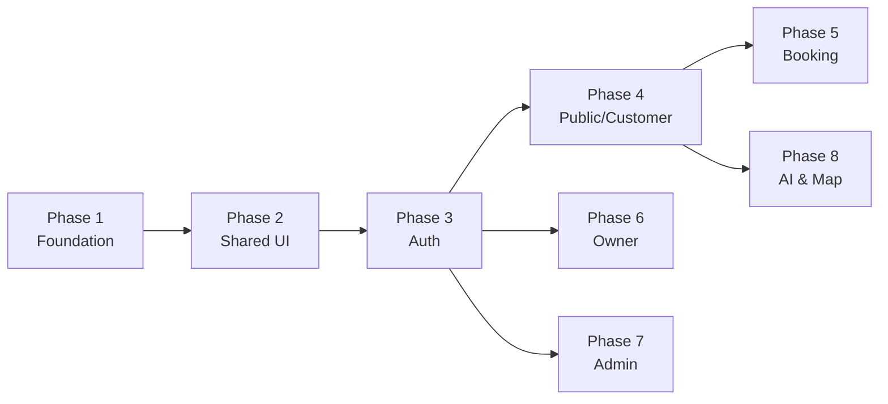

# Kế Hoạch Phát Triển Frontend SeatNow

## Quyết định đã xác nhận

| Hạng mục | Quyết định |
|---|---|
| 🗺️ **Bản đồ** | **Bản đồ nhúng (External Map)** — Nhúng link `https://hoangvhgch220975.github.io/map/` qua iframe, lấy data `lat, lng` lưu db. UI hiển thị qua tham số `?lat=...&lng=...` |
| 🎨 **CSS Framework** | **Tailwind CSS v4** — giữ nguyên `@tailwindcss/vite` v4.2.2 |
| 💳 **Thanh toán** | **Redirect** — FE redirect user sang Momo/VNPay gateway, callback URL nhận kết quả |
| 🚀 **API Gateway** | Sử dụng chung base URL: `http://localhost:7000/api/v1/` cho toàn bộ 8 microservices. |
| ☁️ **Cloudinary** | **Direct Unsigned Upload** (Từ Frontend bắn thẳng ảnh lên Cloudinary). - Cloud Name: Được cấu hình trong `.env` - Upload Preset: Được cấu hình trong `.env` |

---

## Tình trạng hiện tại

| Hạng mục | Trạng thái |
|---|---|
| Cấu trúc thư mục | ✅ Đã tạo đầy đủ theo `stucture.md` |
| Package dependencies | ✅ Đã cài đầy đủ (React 19, Vite 7, Tailwind v4, TanStack Query, Zustand, React Router v7...) |
| Các file code thực tế | ❌ Hầu hết là **placeholder** (nội dung rỗng/comment) |
| `App.jsx` | ⚠️ Chứa HTML tĩnh demo UI, chưa tích hợp Router/Provider |
| `.env` files | ❌ Placeholder, chưa có biến môi trường thực |

> [!IMPORTANT]
> **Nguyên tắc chung:** Mỗi Phase phải hoàn thành và chạy được (có thể verify) trước khi bắt đầu Phase tiếp theo. Code từ gốc (infrastructure) lên ngọn (features).
Code tiếng anh, không dùng kiểu:  { label: 'Thống kê Tổng quát', path: ROUTES.ADMIN_DASHBOARD }, mà dùng kiểu { label: 'General Statistics', path: ROUTES.ADMIN_DASHBOARD }, Comment bằng tiếng việt

---

## Tổng quan 8 Phase

---

## Phase 1: Foundation & Infrastructure (Nền tảng)
> **Mục tiêu:** Thiết lập toàn bộ hạ tầng để app có thể boot lên, điều hướng, gọi API và thiết lập liên kết Cloudinary.

### Thứ tự file cần code:

#### 1.1 Environment & Config
| # | File | Mô tả |
|---|---|---|
| 1 | `.env` | `VITE_API_BASE_URL=http://localhost:7000/api/v1` |
| 2 | `.env.development` | Biến môi trường dev. Chứa: `VITE_CLOUDINARY_CLOUD_NAME=dl4wpi7l0`, `VITE_CLOUDINARY_UPLOAD_PRESET=seatnow_preset` |
| 3 | `src/config/env.js` | Export chuẩn hóa `import.meta.env` → `ENV.API_BASE_URL`, `ENV.CLOUDINARY_CLOUD_NAME`, `ENV.CLOUDINARY_UPLOAD_PRESET` |

#### 1.2 Constants (Hằng số domain)
| # | File | Nội dung |
|---|---|---|
| 4 | `src/constants/bookingStatus.js` | `PENDING`, `CONFIRMED`, `ARRIVED`, `COMPLETED`, `CANCELLED`, `NO_SHOW` |
| 5 | `src/constants/paymentStatus.js` | `pending`, `completed`, `failed` |
| 6 | `src/constants/tableStatus.js` | `available`, `unavailable`, `maintenance` |
| 7 | `src/constants/tableTypes.js` | `standard`, `vip`, `outdoor` |
| 8 | `src/constants/userRoles.js` | `CUSTOMER`, `RESTAURANT_OWNER`, `ADMIN` |
| 9 | `src/constants/restaurantStatus.js` | `pending`, `active`, `suspended` |
| 10 | `src/constants/cuisines.js` | Danh sách cuisine filter |
| 11 | `src/constants/priceRanges.js` | Mapping 1-4 → label |

#### 1.3 Lib (Low-level utilities)
| # | File | Mô tả |
|---|---|---|
| 12 | `src/lib/axios.js` | Axios instance → base URL (Gateway), interceptor attach JWT, handle 401 refresh |
| 13 | `src/lib/queryClient.js` | TanStack QueryClient config (staleTime, retry, devtools) |
| 14 | `src/lib/storage.js` | `getItem`, `setItem`, `removeItem` wrapper |
| 15 | `src/lib/cloudinary.js` | File gọi API trực tiếp lên `api.cloudinary.com` dùng Unsigned Profile |

#### 1.4 Shared Utils
| # | File | Mô tả |
|---|---|---|
| 16 | `src/shared/utils/formatCurrency.js` | Format VND: `1.200.000 ₫` |
| 17 | `src/shared/utils/formatDateTime.js` | Format ngày/giờ bằng `date-fns` |
| 18 | `src/shared/utils/getStatusColor.js` | Status → tailwind color class |
| 19 | `src/shared/utils/buildQueryString.js` | Object → URL query string |
| 20 | `src/shared/utils/parseApiError.js` | Chuẩn hóa error response |
| 21 | `src/shared/utils/downloadFile.js` | Download blob response |

#### 1.5 Config (Routes & Navigation)
| # | File | Mô tả |
|---|---|---|
| 22 | `src/config/roles.js` | Enum roles + permission mapping |
| 23 | `src/config/routes.js` | Tất cả route paths dạng constant: `ROUTES.HOME`, `ROUTES.LOGIN`... |
| 24 | `src/config/nav.public.js` | Menu items cho public/customer |
| 25 | `src/config/nav.owner-main.js` | Menu items cho owner portal |
| 26 | `src/config/nav.restaurant-workspace.js` | Menu items cho restaurant workspace |
| 27 | `src/config/nav.admin.js` | Menu items cho admin |

#### 1.6 Auth Store & Guards
| # | File | Mô tả |
|---|---|---|
| 28 | `src/features/auth/store.js` | Zustand store: `user`, `token`, `isAuthenticated`, `login()`, `logout()` |
| 29 | `src/shared/guards/ProtectedRoute.jsx` | Redirect to login nếu chưa auth |
| 30 | `src/shared/guards/RoleGuard.jsx` | Check role → render children hoặc NoPermission |

#### 1.7 Shared Hooks
| # | File | Mô tả |
|---|---|---|
| 31 | `src/shared/hooks/useDebounce.js` | Debounce value |
| 32 | `src/shared/hooks/usePagination.js` | Page, pageSize, total |
| 33 | `src/shared/hooks/useQueryParams.js` | Read/write URL search params |
| 34 | `src/shared/hooks/useDisclosure.js` | `isOpen`, `onOpen`, `onClose`, `onToggle` |
| 35 | `src/shared/hooks/useUserLocation.js` | Geolocation API wrapper |

#### 1.8 App Bootstrap
| # | File | Mô tả |
|---|---|---|
| 36 | `src/app/store.js` | Root store (re-export auth store) |
| 37 | `src/app/router.jsx` | `createBrowserRouter` với tất cả routes + lazy loading |
| 38 | `src/app/providers.jsx` | Wrap `QueryClientProvider`, `RouterProvider`, `Toaster` |
| 39 | `src/main.jsx` | Entry point → render `<AppProviders />` |
| 40 | `src/App.jsx` | Chuyển từ static HTML → `<Outlet />` wrapper |

---

## Phase 2: Shared UI Components (UI dùng chung)
> **Mục tiêu:** Xây dựng bộ component UI chuẩn để tái sử dụng xuyên suốt app.

| # | File | Mô tả |
|---|---|---|
| 1 | `src/shared/ui/Button.jsx` | Variants: primary, secondary, outline, ghost, danger |
| 2 | `src/shared/ui/Input.jsx` | Input với label, error message, icon support |
| 3 | `src/shared/ui/Select.jsx` | Dropdown chuẩn |
| 4 | `src/shared/ui/Textarea.jsx` | Multi-line input |
| 5 | `src/shared/ui/Modal.jsx` | Dialog overlay với animation |
| 6 | `src/shared/ui/Drawer.jsx` | Slide-in panel (mobile menu, filters) |
| 7 | `src/shared/ui/Badge.jsx` | Badge nhỏ hiển thị trạng thái |
| 8 | `src/shared/ui/Tabs.jsx` | Tab navigation |
| 9 | `src/shared/ui/Table.jsx` | Bảng dữ liệu responsive |
| 10 | `src/shared/ui/EmptyState.jsx` | Hiển thị khi không có data |
| 11 | `src/shared/ui/LoadingSpinner.jsx` | Spinner + Skeleton |
| 12 | `src/shared/ui/ConfirmDialog.jsx` | Xác nhận hành động nguy hiểm |
| 13 | `src/shared/ui/Pagination.jsx` | Phân trang |
| 14 | `src/shared/ui/StatusChip.jsx` | Chip màu theo status |

#### Layouts
| # | File | Mô tả |
|---|---|---|
| 15 | `src/shared/layout/Navbar.jsx` | Top navigation bar (public) |
| 16 | `src/shared/layout/Footer.jsx` | Footer chung |
| 17 | `src/shared/layout/MainLayout.jsx` | Layout public: Navbar + Outlet + Footer |
| 18 | `src/shared/layout/AuthLayout.jsx` | Layout auth: centered card |
| 19 | `src/shared/layout/CustomerLayout.jsx` | Layout user đã đăng nhập |
| 20 | `src/shared/layout/SidebarOwnerMain.jsx` | Sidebar owner portal |
| 21 | `src/shared/layout/OwnerTopbar.jsx` | Topbar owner portal |
| 22 | `src/shared/layout/OwnerMainLayout.jsx` | Layout cấp tài khoản owner |
| 23 | `src/shared/layout/SidebarRestaurantWorkspace.jsx` | Sidebar workspace nhà hàng |
| 24 | `src/shared/layout/RestaurantTopbar.jsx` | Topbar workspace nhà hàng |
| 25 | `src/shared/layout/RestaurantWorkspaceLayout.jsx` | Layout workspace nhà hàng |
| 26 | `src/shared/layout/SidebarAdmin.jsx` | Sidebar admin |
| 27 | `src/shared/layout/AdminLayout.jsx` | Layout admin dashboard |

#### Feedback Components
| # | File | Mô tả |
|---|---|---|
| 28 | `src/shared/feedback/ErrorBoundary.jsx` | Catch runtime errors |
| 29 | `src/shared/feedback/ErrorState.jsx` | Error UI cho API |
| 30 | `src/shared/feedback/SuccessState.jsx` | Success UI |
| 31 | `src/shared/feedback/NoPermission.jsx` | 403 page |

---

## Phase 3: Authentication (Xác thực)
> **Mục tiêu:** User có thể đăng ký, đăng nhập, verify OTP, quên mật khẩu. Tương tác với `auth_service`.

| # | File | Mô tả | API Gateway paths |
|---|---|---|---|
| 1 | `src/features/auth/api.js` | Gọi API auth | `/auth/register`, `/auth/login`, `/auth/verify-otp`, `/auth/forgot-password-customer` |
| 2 | `src/features/auth/schemas.js` | Zod validation cho form | — |
| 3 | `src/features/auth/hooks.js` | `useLogin`, `useRegister`, `useVerifyOtp`, `useForgotPassword` | — |
| 4 | `src/features/auth/components/LoginForm.jsx` | UI login form | — |
| 5 | `src/features/auth/components/RegisterForm.jsx` | UI register form | — |
| 6 | `src/features/auth/components/OtpForm.jsx` | UI OTP verification | — |
| 7 | `src/features/auth/pages/LoginPage.jsx` | Trang login | — |
| 8 | `src/features/auth/pages/RegisterPage.jsx` | Trang đăng ký | — |
| 9 | `src/features/auth/pages/VerifyOtpPage.jsx` | Trang OTP | — |
| 10 | `src/features/auth/pages/ForgotPasswordPage.jsx` | Trang quên MK | — |

---

## Phase 4: Public & Customer Features (Trang công khai)
> **Mục tiêu:** Trang chủ, danh sách nhà hàng, chi tiết, profile, review. Tích điểm Loyalty tự động.

### 4.1 Home Page
| # | File | Mô tả |
|---|---|---|
| 1 | `src/features/home/pages/HomePage.jsx` | Landing page chính |
| 2 | `src/features/home/components/HeroSection.jsx` | Hero banner + Search bar |
| 3 | `src/features/home/components/FeatureSection.jsx` | Giới thiệu tính năng |
| 4 | `src/features/home/components/PopularRestaurants.jsx` | Nhà hàng nổi bật (fetch API) |
| 5 | `src/features/home/components/WhyChooseUs.jsx` | Section lý do chọn SeatNow |
| 6 | `src/features/home/components/CTASection.jsx` | Call-to-action |

### 4.2 Restaurant Listing & Detail
| # | File |
|---|---|
| 7 | `src/features/restaurants/api.js` |
| 8 | `src/features/restaurants/hooks.js` |
| 9 | `src/features/restaurants/components/RestaurantCard.jsx` |
| 10 | `src/features/restaurants/components/RestaurantFilters.jsx` |
| 11 | `src/features/restaurants/pages/RestaurantListPage.jsx` |
| 12 | `src/features/restaurants/components/RestaurantHero.jsx` |
| 13 | `src/features/restaurants/components/RestaurantGallery.jsx` |
| 14 | `src/features/restaurants/components/RestaurantInfo.jsx` |
| 15 | `src/features/restaurants/components/RestaurantMenu.jsx` |
| 16 | `src/features/restaurants/components/ReviewList.jsx` |
| 17 | `src/features/restaurants/components/AvailabilityPanel.jsx` |
| 18 | `src/features/restaurants/pages/RestaurantDetailPage.jsx` |

### 4.3 Profile (Tài khoản người dùng & Tích điểm)
| # | File |
|---|---|
| 19 | `src/features/profile/api.js` (Gọi `/users/...` header kèm JWT) |
| 20 | `src/features/profile/hooks.js` |
| 21 | `src/features/profile/components/ProfileForm.jsx` |
| 22 | `src/features/profile/components/AvatarUploader.jsx` |
| 23 | `src/features/profile/pages/ProfilePage.jsx` |

### 4.4 Reviews
| # | File |
|---|---|
| 24 | `src/features/reviews/api.js` |
| 25 | `src/features/reviews/hooks.js` |
| 26 | `src/features/reviews/components/ReviewForm.jsx` |
| 27 | `src/features/reviews/components/RatingSummary.jsx` |
| 28 | `src/features/reviews/pages/CreateReviewPage.jsx` |

### 4.5 Media (Cloudinary)
| # | File | Mô tả |
|---|---|---|
| 29 | `src/features/media/api.js` | Helper kết nối hàm `uploadToCloudinary` |
| 30 | `src/features/media/hooks.js` | `useImageUpload`, `useMultipleUpload` |
| 31 | `src/features/media/utils/optimizeCloudinaryUrl.js` | URL transform (Resize, Crop qua URL) |
| 32 | `src/features/media/components/ImageUploader.jsx` | Khung UI Input file upload trực tiếp |
| 33 | `src/features/media/components/ImageDropzone.jsx` | Kéo thả ảnh |
| 34 | `src/features/media/components/ImagePreviewList.jsx` | Danh sách ảnh (như Menu/Gallery) |
| 35 | `src/features/media/components/CloudinaryImage.jsx` | Widget/Tối ưu img thẻ `` |

---

## Phase 5: Booking Flow (Luồng đặt bàn)
> **Mục tiêu:** Theo sát quy tắc Slot 2 tiếng, Lock Redis giữ chỗ tạm, hủy đơn hoàn cọc theo Time Rule 3H.
> **Endpoints:** `/bookings/...`, `/payment/...`

| # | File | Mô tả |
|---|---|---|
| 1 | `src/features/booking/api.js` | Tạo yêu cầu (Pending), Thanh toán (Deposit), Lấy QR |
| 2 | `src/features/booking/store.js` | Zustand flow state |
| 3 | `src/features/booking/schemas.js` | Zod validate booking form |
| 4 | `src/features/booking/hooks.js` | Hooks tạo booking và thanh toán redirect |
| 5 | `src/features/booking/components/BookingForm.jsx` | Chọn ngày/giờ/số khách |
| 6 | `src/features/booking/components/TableSelector.jsx` | Hiển thị bàn slot. **Lưu ý rule lock 2 phút** khi click. |
| 7 | `src/features/booking/components/CapacityChecker.jsx` | Kiểm tra sức chứa |
| 8 | `src/features/booking/components/DepositSummary.jsx` | Tóm tắt tiền cọc |
| 9 | `src/features/booking/components/BookingQRCode.jsx` | Hiển thị QR checkin |
| 10 | `src/features/booking/components/BookingStatusBadge.jsx` | Badge theo màu |
| 11 | `src/features/booking/components/CancelBookingDialog.jsx` | Xử lý hủy. Tính logic hoàn tiền/phí theo mốc 3 giờ. |
| 12 | `src/features/booking/pages/CreateBookingPage.jsx` | Đặt bàn (hiển thị UI -> redirect thanh toán) |
| 13 | `src/features/booking/pages/BookingHistoryPage.jsx` | Lịch sử booking của Cust |
| 14 | `src/features/booking/pages/BookingDetailPage.jsx` | Chi tiết Booking (tích hợp QR) |

---

## Phase 6: Owner Portal & Restaurant Workspace
> **Mục tiêu:** Quản lý thông tin, phân tích (dựa vào size khách, theo giờ), xử lý Trạng Thái Booking (Check-in QR -> Arrived, Hoàn thành -> loyalty).

### 6.1 Owner Portal (Cấp tài khoản)
| # | File |
|---|---|
| 1-7 | Các Component quen thuộc + `CreateRestaurantPage` |

### 6.2 Restaurant Workspace (7 modules)

#### Dashboard (Báo cáo linh hoạt)
| # | File | Ghi chú |
|---|---|---|
| 8-12 | Component và Chart thống kê | Hiển thị % Couple, Small Groups, Party. Phân bổ theo giờ. Doanh thu sau phí. |

#### Restaurant Profile, Menu, Tables
| # | File |
|---|---|
| 13-24 | Form cập nhật profile, Tạo thực đơn, Tạo sơ đồ Bàn |

#### Bookings
| # | File | Ghi chú |
|---|---|---|
| 25-29 | D/s Booking, Chi tiết Booking | Chủ động xác nhận trạng thái: Quét QR -> `Arrived`. |

#### Revenue & Wallet
| # | File | Ghi chú |
|---|---|---|
| 30-38 | Chart Doanh Thu, Quản lý Số dư | Tiền cọc ghi nhận vào ví ngay khi `Arrived`. Tính năng nạp/rút tiền. |

---

## Phase 7: Admin Dashboard
> **Mục tiêu:** Quản trị các nhà hàng, duyệt/suspend, duyệt rút tiền, chạy định kỳ lệnh `settleQuarterCommission` thu phí hoa hồng.

| Module |
|---|
| **Dashboard** (Tổng thể hệ thống)|
| **Users** (Ban/Reset mật khẩu) |
| **Restaurants** (Approve Nhà hàng mới -> cấp Wallet tự động) |
| **Bookings & Transactions** (Audit kiểm kê) |
| **Withdrawals** (Duyệt/từ chối rút tiền) |
| **Commissions** (Khấu trừ hoa hồng định kỳ -> ví Admin) |

---

## Phase 8: Advanced Features (AI & Map)
> **Mục tiêu:** Chia 2 luồng AI riêng biệt cho Khách hàng & Admin. Và Render bản đồ External.

### 8.1 AI Assistant (Tích hợp Gemini qua `/api/ai/...`)
| # | File | Mô tả |
|---|---|---|
| 1 | `src/features/ai-assistant/api.js` | Call API gửi tin nhắn tới AI |
| 2 | `src/features/ai-assistant/pages/AIAssistantPage.jsx` | **Luồng 1 (Customer):** UI Trợ lý tư vấn chọn nhà hàng, gợi ý bàn/món ăn theo sở thích. |
| 3 | `src/features/ai-assistant/pages/AdminAIAssistantPage.jsx` | **Luồng 2 (Admin):** UI trợ lý thông minh cho Admin dùng truy vấn số liệu thống kê (VD: "Doanh thu tháng này?"). |
| 4 | `src/features/ai-assistant/components/ChatBox.jsx` | Khung chat dùng chung |
| 5 | `src/features/ai-assistant/components/PromptSuggestions.jsx` | Chip gợi ý thay đổi tùy vai trò người dùng |
| 6 | `src/features/ai-assistant/components/MessageBubble.jsx` | Render JSON/Chart hoặc Text dựa trên trả lời của AI |

### 8.2 Map (Nhúng bản đồ tự xây dựng: hoangvhgch220975.github.io)
| # | File | Mô tả |
|---|---|---|
| 7 | `src/features/map/api.js` | API lấy lat/lng từ DB |
| 8 | `src/features/map/hooks.js` | Hook quản lý map params |
| 9 | `src/features/map/utils/buildPublicMapUrl.js` | Trả về `https://hoangvhgch220975.github.io/map/?lat=..&lng=..` |
| 10 | `src/features/map/components/PublicMapEmbed.jsx` | Component wrapper Iframe để render nội dung |
| 11 | `src/features/map/components/LocationPickerModal.jsx` | Đưa link map / click tạo test tọa độ |
| 12 | `src/features/map/pages/ExploreMapPage.jsx` | Khám phá nhà hàng theo map xung quanh |
| 13 | `src/features/map/pages/RestaurantMapPage.jsx` | View full map chỉ đường cho end-user |

---

## Tóm tắt thống kê

| Phase | Số file | Ưu tiên | Phụ thuộc |
|---|---|---|---|
| Phase 1: Foundation | ~40 files | 🔴 Bắt buộc làm đầu | Không |
| Phase 2: Shared UI | ~31 files | 🔴 Bắt buộc | Phase 1 |
| Phase 3: Auth | ~10 files | 🔴 Bắt buộc | Phase 1, 2 |
| Phase 4: Public/Customer | ~36 files | 🟠 Cao | Phase 1, 2, 3 |
| Phase 5: Booking | ~14 files | 🟠 Cao | Phase 4 |
| Phase 6: Owner | ~38 files | 🟡 Trung bình | Phase 1, 2, 3 |
| Phase 7: Admin | ~25 files | 🟡 Trung bình | Phase 1, 2, 3 |
| Phase 8: AI & Map | ~16 files | 🟢 Bổ sung | Phase 4, Phase 7 |

> **Tổng cộng: ~210 files**
